# Aegis Platform - System Architecture Document

**Document Version**: 1.0
**Created**: 2025-11-10
**Author**: AI:ArtifactCreator
**Decision References**: D-1, D-2, D-3, D-4, D-5
**Research References**: Q-3, Q-6, Q-7, Q-8, Q-10, Q-11

---

## 1. Executive Summary

This document describes the system architecture for **Aegis**, an on-demand security guard marketplace platform connecting customers with certified security professionals. The platform implements a modern, scalable architecture using Node.js, React Native, PostgreSQL with PostGIS, and best-in-class third-party integrations.

**Architecture Principles**:
- **Mobile-First**: React Native apps for iOS and Android with offline support
- **Real-Time**: Live location tracking and job updates via Ably
- **Secure by Design**: JWT authentication, RBAC, comprehensive audit logging
- **Scalable**: Microservices-ready modular monolith with horizontal scaling capability
- **API-Driven**: RESTful API with OpenAPI documentation

---

## 2. C4 Model Architecture Diagrams

### 2.1 System Context Diagram (C4 Level 1)

Shows Aegis in the context of users and external systems.

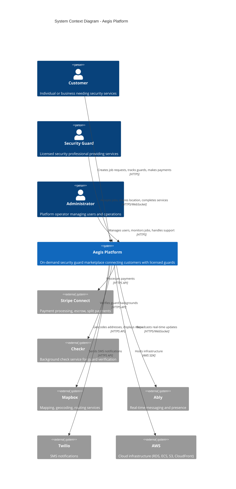

### 2.2 Container Diagram (C4 Level 2)

Shows the high-level architecture with containers (applications and data stores).

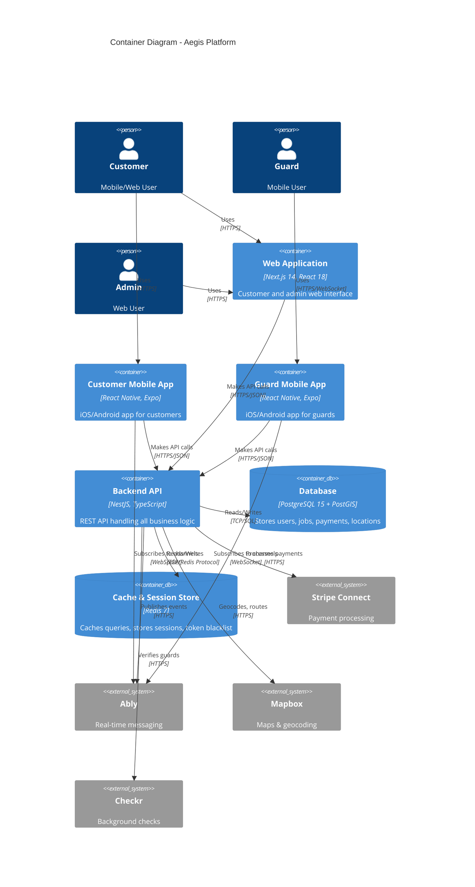

### 2.3 Component Diagram - Backend API (C4 Level 3)

Shows the internal structure of the Backend API container.

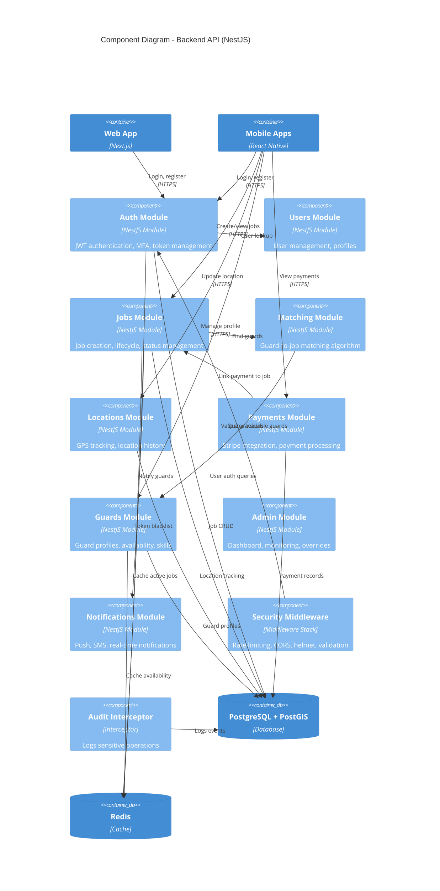

---

## 3. Technology Stack

### 3.1 Frontend Technologies

| Component | Technology | Version | Purpose |
|-----------|-----------|---------|---------|
| **Web App** | Next.js | 14+ | Customer and admin web interface with SSR |
| | React | 18+ | UI framework |
| | Tailwind CSS | 3.x | Utility-first CSS |
| | shadcn/ui | Latest | Component library |
| | TypeScript | 5.x | Type safety |
| **Mobile Apps** | React Native | 0.73+ | iOS and Android apps |
| | Expo | Latest | Managed workflow, OTA updates |
| | expo-location | Latest | GPS tracking |
| | WatermelonDB | Latest | Offline-first local database |
| | Ably SDK | Latest | Real-time updates |
| | Redux Toolkit | Latest | State management |

### 3.2 Backend Technologies

| Component | Technology | Version | Purpose |
|-----------|-----------|---------|---------|
| **API Framework** | NestJS | 10+ | Backend API framework |
| | Node.js | 20 LTS | Runtime |
| | TypeScript | 5.x | Type safety |
| **Database** | PostgreSQL | 15+ | Primary database |
| | PostGIS | 3.x | Geospatial queries |
| | TypeORM | 0.3+ | ORM and migrations |
| **Cache** | Redis | 7+ | Session store, caching, queue |
| **Authentication** | Passport.js | Latest | Auth strategies |
| | JWT | Latest | Token-based auth |
| | bcrypt | 5.x | Password hashing |
| | speakeasy | 2.x | MFA (TOTP) |

### 3.3 Third-Party Services

| Service | Purpose | Tier/Cost |
|---------|---------|-----------|
| **Stripe Connect** | Payment processing, escrow, payouts | 2.9% + $0.30/transaction |
| **Checkr** | Background checks (MVP: mocked) | $50-80/check |
| **Mapbox** | Maps, geocoding, routing | Free: 50K loads/month |
| **Ably** | Real-time messaging, presence | Free: 3M messages/month |
| **Twilio** | SMS notifications (MVP: mocked) | $0.0079/SMS |
| **AWS** | Infrastructure (RDS, ECS, S3, CloudFront) | ~$500-1,500/month |

### 3.4 DevOps & Monitoring

| Component | Technology | Purpose |
|-----------|-----------|---------|
| **Hosting** | AWS ECS Fargate | Container orchestration |
| **Database** | AWS RDS PostgreSQL | Managed database |
| **Storage** | AWS S3 | File storage, backups |
| **CDN** | AWS CloudFront | Asset delivery |
| **CI/CD** | GitHub Actions | Automated testing and deployment |
| **Monitoring** | Datadog | Infrastructure, APM, logs |
| **Error Tracking** | Sentry | Application error tracking |

---

## 4. Data Flow Diagrams

### 4.1 Job Creation & Matching Flow

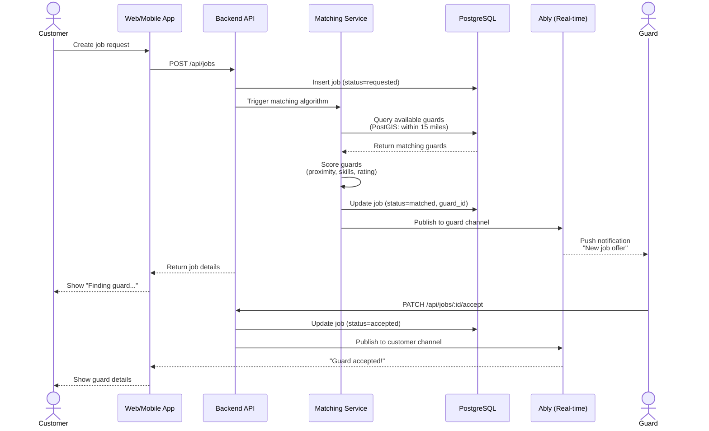

### 4.2 Real-time Location Tracking Flow

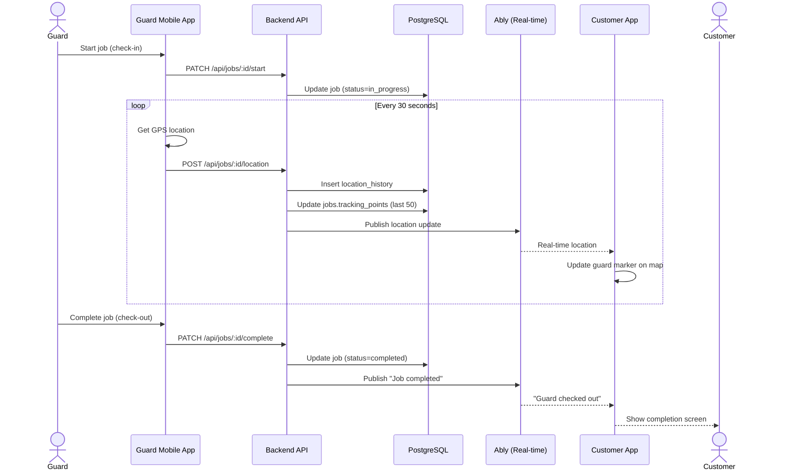

### 4.3 Payment Processing Flow

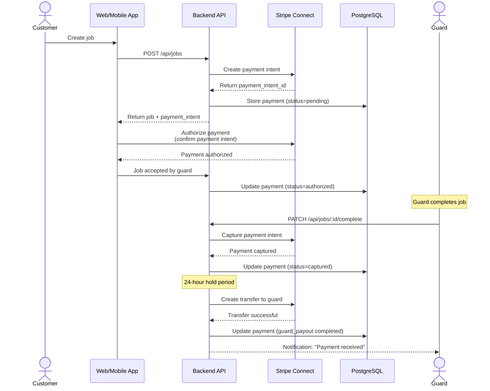

---

## 5. Deployment Architecture

### 5.1 AWS Infrastructure Diagram

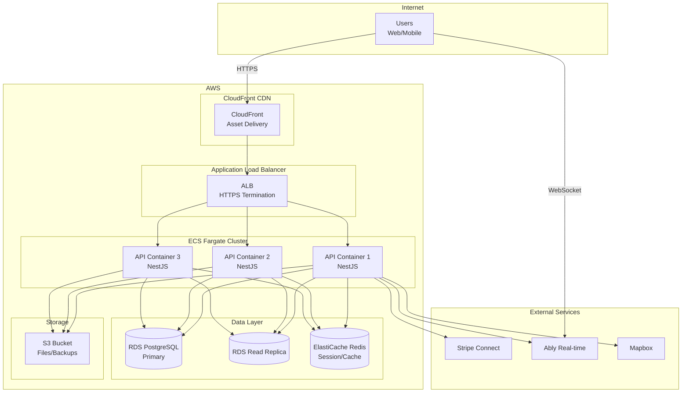

### 5.2 Environment Configuration

| Environment | Purpose | Infrastructure |
|-------------|---------|----------------|
| **Development** | Local development | Local PostgreSQL, Redis, Node.js |
| **Staging** | Pre-production testing | AWS ECS (1 container), RDS (db.t3.medium), Redis (cache.t3.micro) |
| **Production** | Live platform | AWS ECS (3+ containers), RDS (db.t3.large + read replica), Redis (cache.t3.small) HA |

---

## 6. Security Architecture

### 6.1 Security Layers

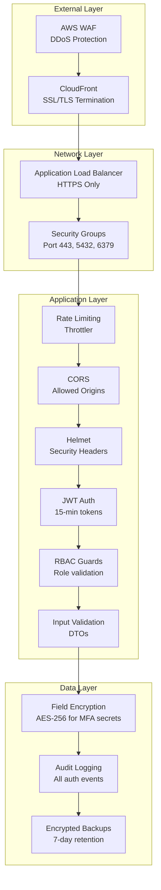

### 6.2 Authentication & Authorization Flow

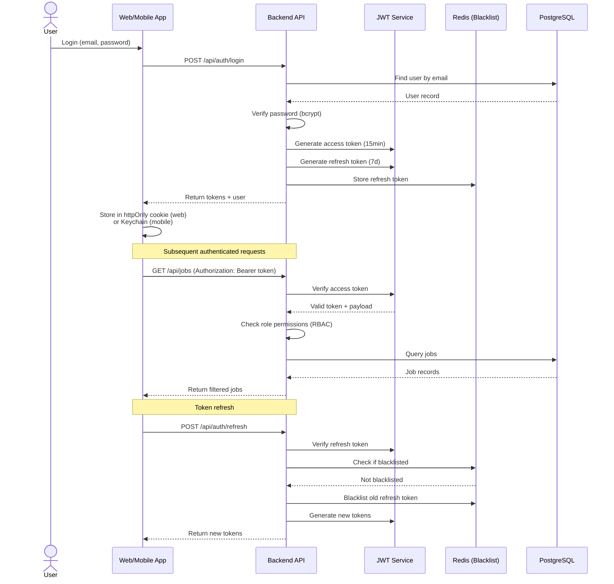

---

## 7. Data Architecture

### 7.1 Entity Relationship Diagram

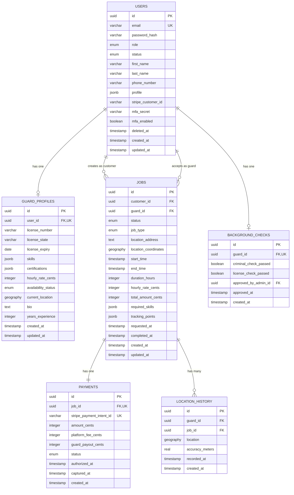

### 7.2 Database Indexes Strategy

| Table | Index Type | Columns | Purpose |
|-------|-----------|---------|---------|
| **users** | B-tree | email (UNIQUE) | Fast login lookup |
| | B-tree | (role, status) | Filter active users by role |
| **guard_profiles** | GIST | current_location | Geospatial matching queries |
| | GIN | skills | Skill filtering (JSONB containment) |
| | B-tree (partial) | availability_status WHERE available | Fast available guard queries |
| **jobs** | B-tree | (status, start_time) | Active jobs sorted by time |
| | GIST | location_coordinates | Nearby jobs queries |
| | B-tree | customer_id | User's job history |
| | B-tree | guard_id | Guard's job history |
| **payments** | B-tree | stripe_payment_intent_id (UNIQUE) | Webhook deduplication |
| | B-tree | job_id (UNIQUE) | One payment per job |
| **location_history** | B-tree | (job_id, recorded_at) | Time-series location queries |
| | GIST | location | Geospatial route queries |

---

## 8. Integration Architecture

### 8.1 Third-Party Integration Patterns

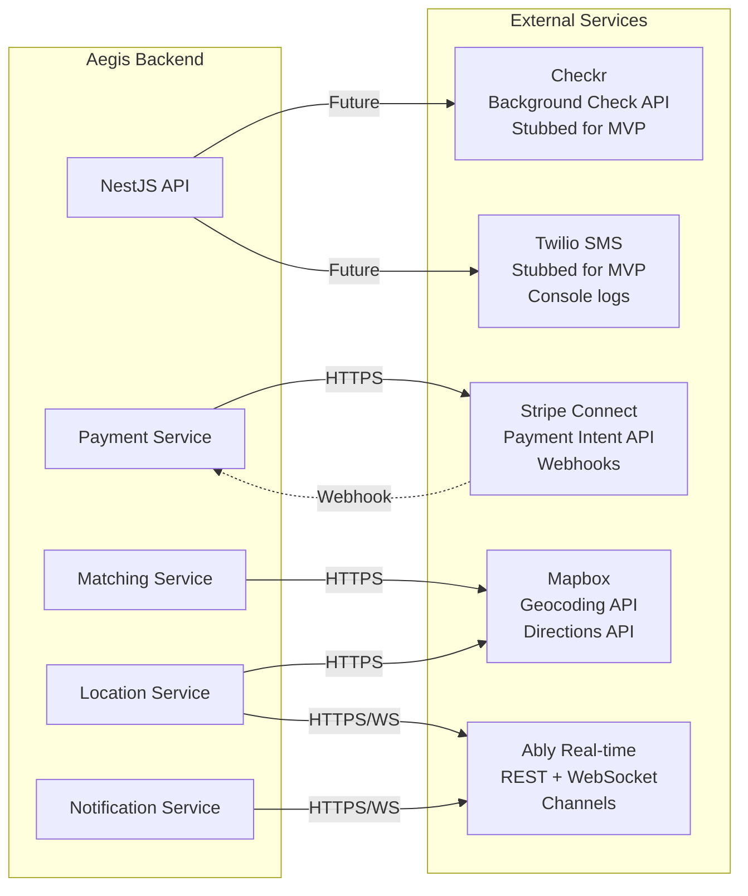

### 8.2 Integration Summary

| Service | Integration Type | Status | Critical Path |
|---------|-----------------|--------|---------------|
| **Stripe Connect** | REST API + Webhooks | Live (test mode) | ✅ Yes - Blocks payment flow |
| **Ably** | REST + WebSocket | Live (free tier) | ✅ Yes - Blocks real-time tracking |
| **Mapbox** | REST API | Live (free tier) | ✅ Yes - Blocks geocoding |
| **Checkr** | REST API | Mocked (manual approval) | ⚠️ No - Can defer to post-MVP |
| **Twilio** | REST API | Mocked (console logs) | ⚠️ No - Email alternative exists |
| **Persona** | REST API | Not implemented | ⚠️ No - Manual license review |

---

## 9. Scalability & Performance

### 9.1 Performance Targets

| Metric | Target | Measurement |
|--------|--------|-------------|
| **API Response Time** | p95 < 200ms, p99 < 500ms | Datadog APM |
| **Database Queries** | < 50ms | PostgreSQL pg_stat_statements |
| **Matching Algorithm** | < 5 seconds | Custom instrumentation |
| **Location Update Latency** | < 2 seconds (mobile → customer) | Ably message timing |
| **Page Load Time** | < 2 seconds | Lighthouse, Web Vitals |
| **Mobile App Launch** | < 3 seconds | Firebase Performance |

### 9.2 Scaling Strategy

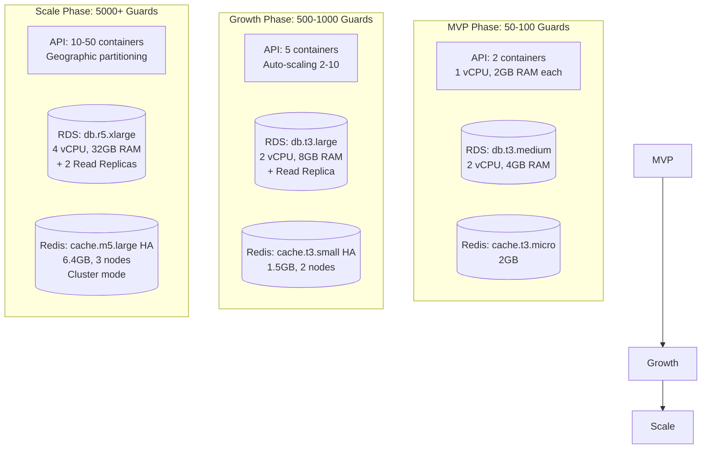

### 9.3 Caching Strategy

| Data Type | Cache Location | TTL | Invalidation |
|-----------|---------------|-----|--------------|
| **Active Jobs** | Redis | 5 minutes | On job status change |
| **Guard Availability** | Redis | 5 minutes | On availability status change |
| **User Sessions** | Redis | 7 days | On logout or token refresh |
| **Guard Profiles** | Redis | 1 hour | On profile update |
| **Query Results** | TypeORM Query Cache (Redis) | 60 seconds | Time-based |

---

## 10. Disaster Recovery & Business Continuity

### 10.1 Backup Strategy

| Component | Backup Frequency | Retention | Recovery Time Objective (RTO) |
|-----------|-----------------|-----------|-------------------------------|
| **Database** | Automated daily (AWS RDS) | 7 days | < 1 hour (point-in-time restore) |
| **Pre-Migration Snapshots** | Before each migration | 30 days | < 15 minutes |
| **Redis** | Not backed up | N/A | N/A (session data, cache rebuild on startup) |
| **Application Config** | Git version control | Infinite | < 5 minutes |
| **File Uploads (S3)** | Versioning enabled | 90 days | Immediate (versioned objects) |

### 10.2 Failure Scenarios

| Scenario | Impact | Mitigation | Recovery Time |
|----------|--------|-----------|---------------|
| **API Container Failure** | Some requests fail | Auto-restart, load balancer routes to healthy containers | < 1 minute |
| **Database Failure** | Platform down | AWS RDS automatic failover to standby | < 2 minutes |
| **Redis Failure** | Auth slower, no cached data | Graceful degradation, rebuild cache | < 5 minutes |
| **Stripe Outage** | No new payments | Queue payment actions, retry when restored | User-facing message |
| **Ably Outage** | No real-time updates | Fall back to polling every 30 seconds | Degraded UX |

---

## 11. Compliance & Privacy

### 11.1 Data Retention Policies

| Data Type | Retention Period | Deletion Method | Compliance Reason |
|-----------|-----------------|-----------------|-------------------|
| **User Account Data** | Until account deletion + 90 days | Soft delete, then hard delete | CCPA, GDPR |
| **Location History** | 30 days | Automated daily cron job | CCPA data minimization |
| **Payment Records** | 7 years | Never deleted | IRS, tax compliance |
| **Audit Logs** | 90 days | Rolling deletion | Security investigations |
| **Job Records** | Indefinite (linked to payments) | Never deleted | Financial audit trail |

### 11.2 Privacy by Design

- **Location Tracking**: Only during active jobs (check-in to check-out)
- **Data Export**: Users can request full data export (CCPA right to access)
- **Data Deletion**: Users can request account deletion (CCPA right to deletion)
- **Transparency**: Privacy policy explains what data is collected and why
- **Consent**: Guards explicitly consent to location tracking before accepting jobs

---

## 12. Monitoring & Observability

### 12.1 Monitoring Stack

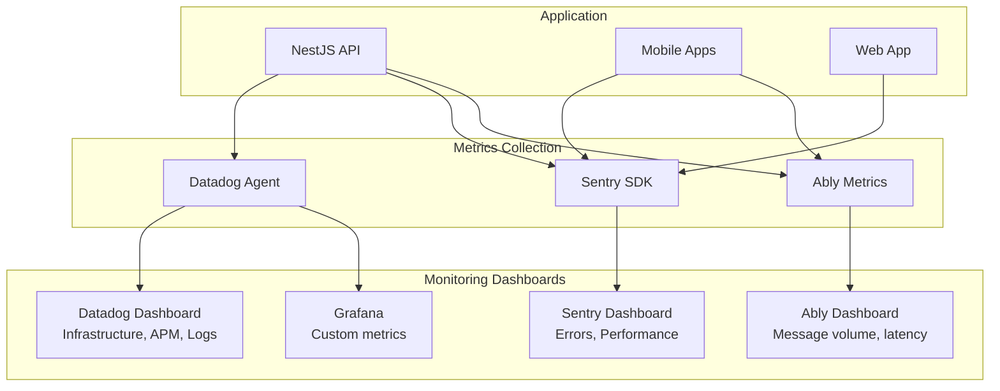

### 12.2 Key Metrics & Alerts

| Metric | Alert Threshold | Action |
|--------|----------------|--------|
| **API Error Rate** | > 1% | Page on-call engineer |
| **API Response Time** | p95 > 500ms | Investigate slow queries |
| **Failed Login Rate** | > 10/min | Possible brute force attack |
| **Database CPU** | > 80% | Scale up RDS instance |
| **Redis Memory** | > 90% | Increase cache size or clear old keys |
| **Job Match Failures** | > 10% | Check matching algorithm or guard supply |
| **Payment Failures** | > 5% | Check Stripe integration |

---

## 13. Future Architecture Evolution

### 13.1 Microservices Migration Path

Current architecture is a **modular monolith** ready for future microservices extraction:

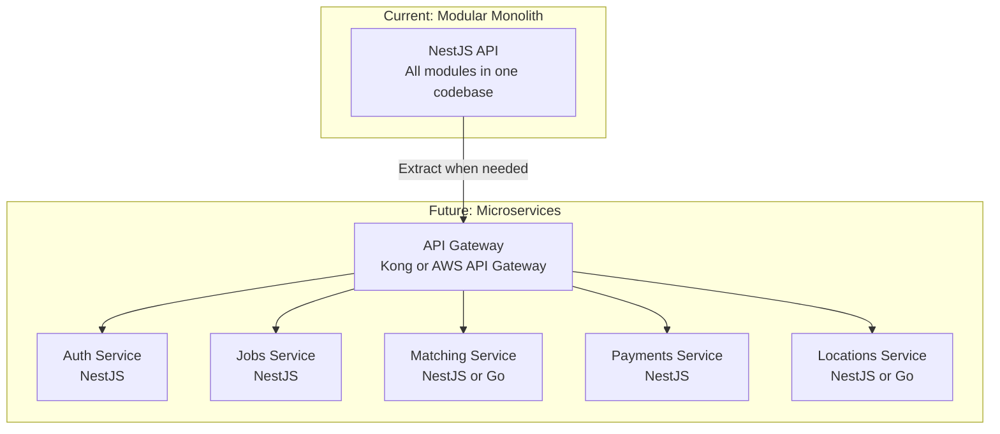

**When to Extract**:
- **Auth Service**: When other services need authentication (external API partners)
- **Matching Service**: When matching algorithm needs independent scaling (high CPU)
- **Locations Service**: When location tracking needs independent scaling (high write volume)

### 13.2 Multi-Region Deployment

For national scale (5000+ guards, 50+ cities):

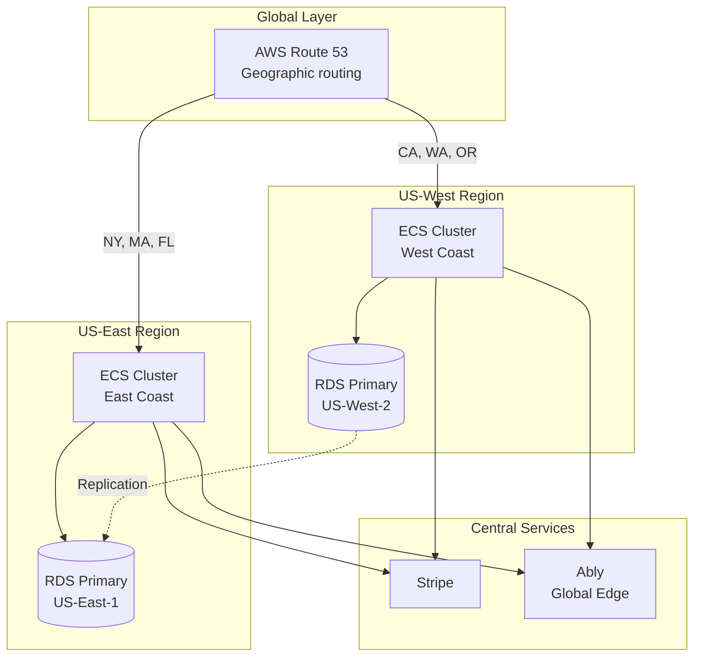

---

## 14. Appendices

### 14.1 Glossary

| Term | Definition |
|------|------------|
| **C4 Model** | Context, Container, Component, Code - hierarchical architecture diagramming method |
| **GIST Index** | Generalized Search Tree index for geospatial queries in PostGIS |
| **JWT** | JSON Web Token - stateless authentication token |
| **RBAC** | Role-Based Access Control - authorization based on user roles |
| **PostGIS** | PostgreSQL extension for geospatial data types and queries |
| **TOTP** | Time-based One-Time Password - MFA standard (6-digit codes) |
| **Escrow** | Holding payment in custody until service completion |

### 14.2 References

- **Decision Documents**: D-1, D-2, D-3, D-4, D-5 in `lattice/` directory
- **Research Reports**: Q-3, Q-6, Q-7, Q-8, Q-10, Q-11 in `lattice/` directory
- **Artifact Specifications**: A-4-1, A-4-2, A-4-3, A-5-1, A-5-2, A-5-3 in `specs/` directory
- **C4 Model**: https://c4model.com/
- **PostGIS Documentation**: https://postgis.net/documentation/
- **NestJS Documentation**: https://docs.nestjs.com/
- **React Native Documentation**: https://reactnative.dev/

---

**End of Document**

**Document Status**: ✅ Complete
**Last Updated**: 2025-11-10
**Next Review**: After D-6, D-7, D-8, D-9 decisions are made
