# Aegis Platform - System Architecture Document

**Document Version**: 1.0
**Created**: 2025-11-10
**Author**: AI:ArtifactCreator
**Decision References**: D-1, D-2, D-3, D-4, D-5
**Research References**: Q-3, Q-6, Q-7, Q-8, Q-10, Q-11

---

## 1. Executive Summary

This document describes the system architecture for **Aegis**, an on-demand security guard marketplace platform connecting customers with certified security professionals. The platform implements a modern, scalable architecture using Node.js, React Native, PostgreSQL with PostGIS, and best-in-class third-party integrations.

**Architecture Principles**:
- **Mobile-First**: React Native apps for iOS and Android with offline support
- **Real-Time**: Live location tracking and job updates via Ably
- **Secure by Design**: JWT authentication, RBAC, comprehensive audit logging
- **Scalable**: Microservices-ready modular monolith with horizontal scaling capability
- **API-Driven**: RESTful API with OpenAPI documentation

---

## 2. C4 Model Architecture Diagrams

### 2.1 System Context Diagram (C4 Level 1)

Shows Aegis in the context of users and external systems.


### 2.2 Container Diagram (C4 Level 2)

Shows the high-level architecture with containers (applications and data stores).


### 2.3 Component Diagram - Backend API (C4 Level 3)

Shows the internal structure of the Backend API container.


---

## 3. Technology Stack

### 3.1 Frontend Technologies

| Component | Technology | Version | Purpose |
|-----------|-----------|---------|---------|
| **Web App** | Next.js | 14+ | Customer and admin web interface with SSR |
| | React | 18+ | UI framework |
| | Tailwind CSS | 3.x | Utility-first CSS |
| | shadcn/ui | Latest | Component library |
| | TypeScript | 5.x | Type safety |
| **Mobile Apps** | React Native | 0.73+ | iOS and Android apps |
| | Expo | Latest | Managed workflow, OTA updates |
| | expo-location | Latest | GPS tracking |
| | WatermelonDB | Latest | Offline-first local database |
| | Ably SDK | Latest | Real-time updates |
| | Redux Toolkit | Latest | State management |

### 3.2 Backend Technologies

| Component | Technology | Version | Purpose |
|-----------|-----------|---------|---------|
| **API Framework** | NestJS | 10+ | Backend API framework |
| | Node.js | 20 LTS | Runtime |
| | TypeScript | 5.x | Type safety |
| **Database** | PostgreSQL | 15+ | Primary database |
| | PostGIS | 3.x | Geospatial queries |
| | TypeORM | 0.3+ | ORM and migrations |
| **Cache** | Redis | 7+ | Session store, caching, queue |
| **Authentication** | Passport.js | Latest | Auth strategies |
| | JWT | Latest | Token-based auth |
| | bcrypt | 5.x | Password hashing |
| | speakeasy | 2.x | MFA (TOTP) |

### 3.3 Third-Party Services

| Service | Purpose | Tier/Cost |
|---------|---------|-----------|
| **Stripe Connect** | Payment processing, escrow, payouts | 2.9% + $0.30/transaction |
| **Checkr** | Background checks (MVP: mocked) | $50-80/check |
| **Mapbox** | Maps, geocoding, routing | Free: 50K loads/month |
| **Ably** | Real-time messaging, presence | Free: 3M messages/month |
| **Twilio** | SMS notifications (MVP: mocked) | $0.0079/SMS |
| **AWS** | Infrastructure (RDS, ECS, S3, CloudFront) | ~$500-1,500/month |

### 3.4 DevOps & Monitoring

| Component | Technology | Purpose |
|-----------|-----------|---------|
| **Hosting** | AWS ECS Fargate | Container orchestration |
| **Database** | AWS RDS PostgreSQL | Managed database |
| **Storage** | AWS S3 | File storage, backups |
| **CDN** | AWS CloudFront | Asset delivery |
| **CI/CD** | GitHub Actions | Automated testing and deployment |
| **Monitoring** | Datadog | Infrastructure, APM, logs |
| **Error Tracking** | Sentry | Application error tracking |

---

## 4. Data Flow Diagrams

### 4.1 Job Creation & Matching Flow


### 4.2 Real-time Location Tracking Flow


### 4.3 Payment Processing Flow


---

## 5. Deployment Architecture

### 5.1 AWS Infrastructure Diagram


### 5.2 Environment Configuration

| Environment | Purpose | Infrastructure |
|-------------|---------|----------------|
| **Development** | Local development | Local PostgreSQL, Redis, Node.js |
| **Staging** | Pre-production testing | AWS ECS (1 container), RDS (db.t3.medium), Redis (cache.t3.micro) |
| **Production** | Live platform | AWS ECS (3+ containers), RDS (db.t3.large + read replica), Redis (cache.t3.small) HA |

---

## 6. Security Architecture

### 6.1 Security Layers


### 6.2 Authentication & Authorization Flow


---

## 7. Data Architecture

### 7.1 Entity Relationship Diagram


### 7.2 Database Indexes Strategy

| Table | Index Type | Columns | Purpose |
|-------|-----------|---------|---------|
| **users** | B-tree | email (UNIQUE) | Fast login lookup |
| | B-tree | (role, status) | Filter active users by role |
| **guard_profiles** | GIST | current_location | Geospatial matching queries |
| | GIN | skills | Skill filtering (JSONB containment) |
| | B-tree (partial) | availability_status WHERE available | Fast available guard queries |
| **jobs** | B-tree | (status, start_time) | Active jobs sorted by time |
| | GIST | location_coordinates | Nearby jobs queries |
| | B-tree | customer_id | User's job history |
| | B-tree | guard_id | Guard's job history |
| **payments** | B-tree | stripe_payment_intent_id (UNIQUE) | Webhook deduplication |
| | B-tree | job_id (UNIQUE) | One payment per job |
| **location_history** | B-tree | (job_id, recorded_at) | Time-series location queries |
| | GIST | location | Geospatial route queries |

---

## 8. Integration Architecture

### 8.1 Third-Party Integration Patterns


### 8.2 Integration Summary

| Service | Integration Type | Status | Critical Path |
|---------|-----------------|--------|---------------|
| **Stripe Connect** | REST API + Webhooks | Live (test mode) | ✅ Yes - Blocks payment flow |
| **Ably** | REST + WebSocket | Live (free tier) | ✅ Yes - Blocks real-time tracking |
| **Mapbox** | REST API | Live (free tier) | ✅ Yes - Blocks geocoding |
| **Checkr** | REST API | Mocked (manual approval) | ⚠️ No - Can defer to post-MVP |
| **Twilio** | REST API | Mocked (console logs) | ⚠️ No - Email alternative exists |
| **Persona** | REST API | Not implemented | ⚠️ No - Manual license review |

---

## 9. Scalability & Performance

### 9.1 Performance Targets

| Metric | Target | Measurement |
|--------|--------|-------------|
| **API Response Time** | p95 < 200ms, p99 < 500ms | Datadog APM |
| **Database Queries** | < 50ms | PostgreSQL pg_stat_statements |
| **Matching Algorithm** | < 5 seconds | Custom instrumentation |
| **Location Update Latency** | < 2 seconds (mobile → customer) | Ably message timing |
| **Page Load Time** | < 2 seconds | Lighthouse, Web Vitals |
| **Mobile App Launch** | < 3 seconds | Firebase Performance |

### 9.2 Scaling Strategy


### 9.3 Caching Strategy

| Data Type | Cache Location | TTL | Invalidation |
|-----------|---------------|-----|--------------|
| **Active Jobs** | Redis | 5 minutes | On job status change |
| **Guard Availability** | Redis | 5 minutes | On availability status change |
| **User Sessions** | Redis | 7 days | On logout or token refresh |
| **Guard Profiles** | Redis | 1 hour | On profile update |
| **Query Results** | TypeORM Query Cache (Redis) | 60 seconds | Time-based |

---

## 10. Disaster Recovery & Business Continuity

### 10.1 Backup Strategy

| Component | Backup Frequency | Retention | Recovery Time Objective (RTO) |
|-----------|-----------------|-----------|-------------------------------|
| **Database** | Automated daily (AWS RDS) | 7 days | < 1 hour (point-in-time restore) |
| **Pre-Migration Snapshots** | Before each migration | 30 days | < 15 minutes |
| **Redis** | Not backed up | N/A | N/A (session data, cache rebuild on startup) |
| **Application Config** | Git version control | Infinite | < 5 minutes |
| **File Uploads (S3)** | Versioning enabled | 90 days | Immediate (versioned objects) |

### 10.2 Failure Scenarios

| Scenario | Impact | Mitigation | Recovery Time |
|----------|--------|-----------|---------------|
| **API Container Failure** | Some requests fail | Auto-restart, load balancer routes to healthy containers | < 1 minute |
| **Database Failure** | Platform down | AWS RDS automatic failover to standby | < 2 minutes |
| **Redis Failure** | Auth slower, no cached data | Graceful degradation, rebuild cache | < 5 minutes |
| **Stripe Outage** | No new payments | Queue payment actions, retry when restored | User-facing message |
| **Ably Outage** | No real-time updates | Fall back to polling every 30 seconds | Degraded UX |

---

## 11. Compliance & Privacy

### 11.1 Data Retention Policies

| Data Type | Retention Period | Deletion Method | Compliance Reason |
|-----------|-----------------|-----------------|-------------------|
| **User Account Data** | Until account deletion + 90 days | Soft delete, then hard delete | CCPA, GDPR |
| **Location History** | 30 days | Automated daily cron job | CCPA data minimization |
| **Payment Records** | 7 years | Never deleted | IRS, tax compliance |
| **Audit Logs** | 90 days | Rolling deletion | Security investigations |
| **Job Records** | Indefinite (linked to payments) | Never deleted | Financial audit trail |

### 11.2 Privacy by Design

- **Location Tracking**: Only during active jobs (check-in to check-out)
- **Data Export**: Users can request full data export (CCPA right to access)
- **Data Deletion**: Users can request account deletion (CCPA right to deletion)
- **Transparency**: Privacy policy explains what data is collected and why
- **Consent**: Guards explicitly consent to location tracking before accepting jobs

---

## 12. Monitoring & Observability

### 12.1 Monitoring Stack


### 12.2 Key Metrics & Alerts

| Metric | Alert Threshold | Action |
|--------|----------------|--------|
| **API Error Rate** | > 1% | Page on-call engineer |
| **API Response Time** | p95 > 500ms | Investigate slow queries |
| **Failed Login Rate** | > 10/min | Possible brute force attack |
| **Database CPU** | > 80% | Scale up RDS instance |
| **Redis Memory** | > 90% | Increase cache size or clear old keys |
| **Job Match Failures** | > 10% | Check matching algorithm or guard supply |
| **Payment Failures** | > 5% | Check Stripe integration |

---

## 13. Operations & Automation

### 13.1 CI/CD Pipeline

**Automated Build & Deployment Pipeline** using GitHub Actions:

```mermaid
graph LR
    subgraph Development
        Dev[Developer Push]
        PR[Pull Request]
    end

    subgraph CI Pipeline
        Lint[Lint & Format<br/>ESLint, Prettier]
        Test[Unit Tests<br/>Jest]
        Build[Build<br/>TypeScript]
        Scan[Security Scan<br/>Dependabot, Snyk]
    end

    subgraph CD Pipeline - Staging
        StageDeploy[Deploy to Staging<br/>ECS]
        E2E[E2E Tests<br/>Playwright]
        IntegTest[Integration Tests]
    end

    subgraph CD Pipeline - Production
        Approve[Manual Approval]
        ProdDeploy[Deploy to Production<br/>ECS Blue/Green]
        Smoke[Smoke Tests]
        Rollback[Auto Rollback<br/>on Failure]
    end

    Dev --> Lint
    PR --> Lint
    Lint --> Test
    Test --> Build
    Build --> Scan
    Scan --> StageDeploy
    StageDeploy --> E2E
    E2E --> IntegTest
    IntegTest --> Approve
    Approve --> ProdDeploy
    ProdDeploy --> Smoke
    Smoke -.-> Rollback
```



**Pipeline Configuration**:
```yaml
# .github/workflows/ci-cd.yml (excerpt)
name: CI/CD Pipeline

on:
  push:
    branches: [main, develop]
  pull_request:
    branches: [main]

jobs:
  test:
    runs-on: ubuntu-latest
    steps:
      - uses: actions/checkout@v3
      - name: Run Tests
        run: npm run test:ci
      - name: Coverage Report
        run: npm run test:coverage

  security:
    runs-on: ubuntu-latest
    steps:
      - name: Run Snyk Security Scan
        uses: snyk/actions/node@master
      - name: Check Dependencies
        run: npm audit --audit-level=moderate

  deploy-staging:
    needs: [test, security]
    runs-on: ubuntu-latest
    steps:
      - name: Deploy to ECS Staging
        run: ./scripts/deploy-staging.sh

  deploy-production:
    needs: [deploy-staging]
    environment: production
    runs-on: ubuntu-latest
    steps:
      - name: Deploy to ECS Production
        run: ./scripts/deploy-production.sh
```

### 13.2 Infrastructure as Code

**Terraform Configuration** for reproducible infrastructure:

```
infrastructure/
├── terraform/
│   ├── modules/
│   │   ├── vpc/
│   │   ├── ecs/
│   │   ├── rds/
│   │   ├── redis/
│   │   └── alb/
│   ├── environments/
│   │   ├── staging/
│   │   │   └── main.tf
│   │   └── production/
│   │       └── main.tf
│   └── variables.tf
└── scripts/
    ├── deploy-staging.sh
    ├── deploy-production.sh
    └── rollback.sh
```

**Key Infrastructure Components**:
- **VPC**: Isolated network with public/private subnets
- **ECS Fargate**: Container orchestration with auto-scaling
- **RDS PostgreSQL**: Multi-AZ deployment with automated backups
- **ElastiCache Redis**: High-availability configuration
- **Application Load Balancer**: HTTPS termination, health checks
- **CloudWatch**: Log aggregation and monitoring

### 13.3 Testing Strategy

**Comprehensive Testing Pyramid**:

| Test Type | Coverage Goal | Tool | Execution |
|-----------|--------------|------|-----------|
| **Unit Tests** | >90% | Jest | Every commit |
| **Integration Tests** | >80% | Jest + Supertest | Every commit |
| **E2E Tests** | Critical paths | Playwright | Pre-deployment |
| **API Contract Tests** | 100% endpoints | Pact | Every commit |
| **Load Tests** | Key endpoints | k6 | Weekly, pre-release |
| **Security Tests** | OWASP Top 10 | OWASP ZAP | Weekly |
| **Chaos Tests** | Failure scenarios | Custom scripts | Bi-weekly (staging) |

**Automated Test Execution**:
```typescript
// Example test structure
describe('CreateBookingUseCase', () => {
  describe('Unit Tests', () => {
    it('should create booking with valid input', async () => {
      // Isolated unit test with mocks
    });
  });

  describe('Integration Tests', () => {
    it('should persist booking to database', async () => {
      // Test with real database (test container)
    });
  });
});

describe('Booking API E2E', () => {
  it('should complete full booking flow', async () => {
    // Full end-to-end test via HTTP
  });
});
```

**Test Coverage Requirements**:
- Domain Layer: 100% coverage (pure logic)
- Application Layer: 90% coverage (use cases)
- Infrastructure Layer: 80% coverage (adapters)
- Presentation Layer: 70% coverage (controllers)

### 13.4 Chaos Engineering

**Failure Testing Strategy** to validate resilience:

| Test Scenario | Frequency | Expected Outcome |
|---------------|-----------|------------------|
| **ECS Container Kill** | Bi-weekly | Auto-restart within 30s, no request failures |
| **Database Connection Loss** | Bi-weekly | Graceful degradation, connection pool retry |
| **Redis Failure** | Monthly | System continues (no cache), rebuild on recovery |
| **Network Latency Injection** | Monthly | Request timeout handling, circuit breaker activation |
| **Third-party API Failure** | Monthly | Fallback logic, queuing for retry |
| **High CPU Load** | Monthly | Auto-scaling triggers, performance degradation alert |
| **Disk Space Exhaustion** | Quarterly | Alert triggers, log rotation, cleanup scripts |

**Chaos Testing Tools**:
- **AWS FIS**: AWS Fault Injection Simulator for infrastructure tests
- **Custom Scripts**: Kill containers, inject latency
- **Load Testing**: k6 for traffic spikes

**Example Chaos Test**:
```bash
#!/bin/bash
# chaos-test-container-failure.sh

echo "Starting chaos test: ECS container failure"

# Get running container ID
TASK_ARN=$(aws ecs list-tasks --cluster aegis-staging --service-name api | jq -r '.taskArns[0]')

# Kill container
aws ecs stop-task --cluster aegis-staging --task $TASK_ARN --reason "Chaos test"

# Monitor recovery
echo "Monitoring service recovery..."
for i in {1..60}; do
  RUNNING=$(aws ecs describe-services --cluster aegis-staging --services api | jq '.services[0].runningCount')
  if [ "$RUNNING" -ge 2 ]; then
    echo "Recovery successful in ${i} seconds"
    exit 0
  fi
  sleep 1
done

echo "ERROR: Recovery failed"
exit 1
```

### 13.5 Cost Monitoring & Optimization

**AWS Cost Management Strategy**:

| Component | Estimated Monthly Cost | Optimization Strategy |
|-----------|----------------------|----------------------|
| **ECS Fargate** | $200-400 | Right-size containers, auto-scaling policies |
| **RDS PostgreSQL** | $150-300 | Reserved instances, read replica optimization |
| **ElastiCache Redis** | $50-100 | Right-size nodes, eviction policies |
| **Data Transfer** | $50-150 | CloudFront caching, compression |
| **S3 Storage** | $20-50 | Lifecycle policies, intelligent tiering |
| **CloudWatch Logs** | $30-80 | Log retention policies, sampling |
| **Third-party APIs** | $200-500 | Rate limiting, caching, batching |
| **Total** | **$700-1,580/month** | Target: <$1,000 for MVP |

**Cost Monitoring Setup**:
1. **AWS Cost Explorer**: Daily cost tracking by service
2. **Budget Alerts**:
   - Alert at 80% of monthly budget ($800)
   - Critical alert at 100% ($1,000)
3. **Cost Anomaly Detection**: AWS native anomaly detection
4. **Tag-based Tracking**: Track costs by environment (staging/prod)

**Cost Optimization Actions**:
```yaml
# cost-optimization-checklist.yml
daily:
  - Review Cost Explorer dashboard
  - Check for unused resources (orphaned EBS, idle instances)

weekly:
  - Analyze CloudWatch metrics for over-provisioning
  - Review third-party API usage (Stripe, Ably, Mapbox)

monthly:
  - Right-size EC2/ECS resources based on utilization
  - Review RDS storage growth, optimize queries
  - Evaluate reserved instance opportunities

quarterly:
  - Comprehensive cost review with stakeholders
  - Evaluate alternative services (cost vs. features)
```

### 13.6 Security Automation

**Automated Security Measures**:

| Tool | Purpose | Frequency | Action on Finding |
|------|---------|-----------|-------------------|
| **Dependabot** | Dependency vulnerability scanning | Real-time | Auto-create PR for patch versions |
| **Snyk** | Code & container scanning | Every commit | Block PR if critical vulnerabilities |
| **OWASP ZAP** | Web application security testing | Weekly | Create Jira ticket for findings |
| **AWS GuardDuty** | Threat detection | Continuous | Alert security team |
| **AWS Inspector** | Infrastructure assessment | Weekly | Create remediation tasks |
| **Trivy** | Container image scanning | Build time | Block deployment if critical |

**Vulnerability Response SLA**:
- **Critical**: Fix within 24 hours
- **High**: Fix within 7 days
- **Medium**: Fix within 30 days
- **Low**: Fix in next sprint

### 13.7 Monitoring Enhancements

**Advanced Monitoring Capabilities**:

**Anomaly Detection** (Datadog):
- Automatic detection of unusual patterns in:
  - API response times
  - Error rates
  - Database query performance
  - Payment failure rates
  - Failed login attempts

**Custom Dashboards**:
```yaml
# Key Dashboards
- Business Metrics:
    - Bookings created (per hour)
    - Booking completion rate
    - Average match time
    - Guard acceptance rate
    - Payment success rate

- Technical Metrics:
    - API p95/p99 latency
    - Database connection pool utilization
    - Redis hit rate
    - ECS CPU/Memory utilization
    - Error rate by endpoint

- Security Metrics:
    - Failed login attempts
    - Rate limit hits
    - Suspicious IP activity
    - API token misuse
```

**On-call Alerting Strategy**:
```yaml
# PagerDuty Integration
severity_levels:
  P1_critical:
    - Platform down (>50% error rate)
    - Database unreachable
    - Payment processing failed (>10% failure rate)
    - Security breach detected
    response_time: Immediate

  P2_high:
    - API latency >1s (p95)
    - Error rate 5-10%
    - Database CPU >90%
    - Redis memory >95%
    response_time: 15 minutes

  P3_medium:
    - Error rate 1-5%
    - API latency 500ms-1s
    - Disk space >80%
    response_time: 1 hour

  P4_low:
    - Non-critical warnings
    - Capacity planning alerts
    response_time: Next business day
```

### 13.8 Operational Runbooks

**Standard Operating Procedures**:

```
operations/runbooks/
├── deployment/
│   ├── production-deployment.md
│   ├── rollback-procedure.md
│   └── database-migration.md
├── incident-response/
│   ├── api-down.md
│   ├── database-performance.md
│   ├── payment-failures.md
│   └── security-incident.md
├── maintenance/
│   ├── scaling-resources.md
│   ├── log-rotation.md
│   └── backup-restoration.md
└── monitoring/
    ├── alert-response.md
    └── dashboard-guide.md
```

**Example Runbook Excerpt**:
```markdown
# Runbook: High API Error Rate

## Symptoms
- Datadog alert: "API Error Rate >5%"
- Multiple 500 errors in logs
- Customer complaints about service unavailable

## Initial Assessment (5 min)
1. Check Datadog dashboard for error patterns
2. Review CloudWatch logs for error messages
3. Verify third-party service status (Stripe, Ably)
4. Check ECS container health

## Common Causes & Solutions
1. **Database connection exhaustion**
   - Check RDS connection count
   - Action: Scale up RDS or increase connection pool

2. **Memory leak in container**
   - Check ECS memory metrics
   - Action: Restart containers, investigate leak

3. **Third-party API failure**
   - Check Stripe/Ably status pages
   - Action: Enable fallback/retry logic

## Escalation
- If unresolved in 30 min → Escalate to senior engineer
- If revenue impact → Notify product/business stakeholders
```

---

## 14. Future Architecture Evolution

### 14.1 Microservices Migration Path

Current architecture is a **modular monolith** ready for future microservices extraction:


**When to Extract**:
- **Auth Service**: When other services need authentication (external API partners)
- **Matching Service**: When matching algorithm needs independent scaling (high CPU)
- **Locations Service**: When location tracking needs independent scaling (high write volume)

### 14.2 Multi-Region Deployment

For national scale (5000+ guards, 50+ cities):


---

## 15. Appendices

### 15.1 Glossary

| Term | Definition |
|------|------------|
| **C4 Model** | Context, Container, Component, Code - hierarchical architecture diagramming method |
| **GIST Index** | Generalized Search Tree index for geospatial queries in PostGIS |
| **JWT** | JSON Web Token - stateless authentication token |
| **RBAC** | Role-Based Access Control - authorization based on user roles |
| **PostGIS** | PostgreSQL extension for geospatial data types and queries |
| **TOTP** | Time-based One-Time Password - MFA standard (6-digit codes) |
| **Escrow** | Holding payment in custody until service completion |

### 15.2 References

- **Decision Documents**: D-1, D-2, D-3, D-4, D-5 in `lattice/` directory
- **Research Reports**: Q-3, Q-6, Q-7, Q-8, Q-10, Q-11 in `lattice/` directory
- **Artifact Specifications**: A-4-1, A-4-2, A-4-3, A-5-1, A-5-2, A-5-3 in `specs/` directory
- **C4 Model**: https://c4model.com/
- **PostGIS Documentation**: https://postgis.net/documentation/
- **NestJS Documentation**: https://docs.nestjs.com/
- **React Native Documentation**: https://reactnative.dev/

---

**End of Document**

**Document Status**: ✅ Complete
**Last Updated**: 2025-11-10
**Next Review**: After D-6, D-7, D-8, D-9 decisions are made
