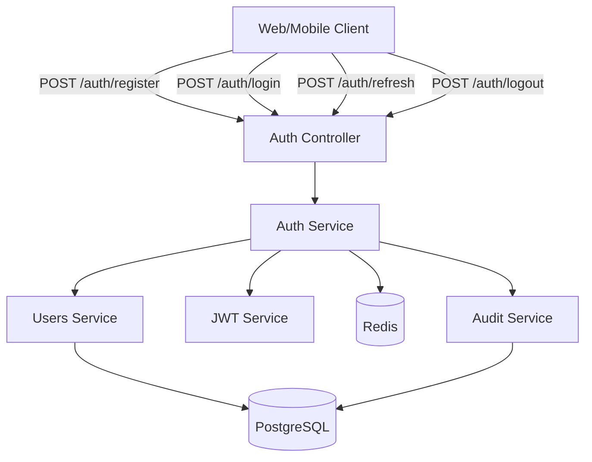

# Authentication Service Specification (SDS)

**Document Version**: 1.0
**Created**: 2025-11-09
**Author**: AI:ArtifactCreator
**Decision Reference**: D-4-AuthenticationAuthorizationArchitecture

---

## 1. Overview

This document specifies the **Authentication Service** for the Aegis platform, implementing stateless JWT-based authentication with bcrypt password hashing, token rotation, Redis-based revocation, and MFA support.

### 1.1 Purpose

Provide secure, scalable authentication for web and mobile applications with the following capabilities:
- User registration with password validation
- Login with email/password credentials
- JWT access token generation (15-minute expiry)
- Refresh token rotation (7-day expiry)
- Token revocation (logout, password change, account suspension)
- Multi-factor authentication (TOTP) for admin accounts
- Comprehensive audit logging

### 1.2 Scope

**In Scope**:
- User registration and password hashing
- JWT token generation and validation
- Token refresh with rotation
- Password-based login
- MFA setup and verification
- Token revocation and blacklisting
- Audit logging for auth events

**Out of Scope** (Future):
- OAuth 2.0 social login (Google, Apple)
- Password reset via email
- Email verification
- Passwordless authentication (WebAuthn)

---

## 2. Architecture

### 2.1 Module Structure

```
src/
├── modules/
│   ├── auth/
│   │   ├── auth.module.ts
│   │   ├── auth.controller.ts
│   │   ├── auth.service.ts
│   │   ├── strategies/
│   │   │   ├── jwt.strategy.ts
│   │   │   └── local.strategy.ts
│   │   ├── guards/
│   │   │   ├── jwt-auth.guard.ts
│   │   │   └── local-auth.guard.ts
│   │   ├── dto/
│   │   │   ├── register.dto.ts
│   │   │   ├── login.dto.ts
│   │   │   ├── refresh-token.dto.ts
│   │   │   └── enable-mfa.dto.ts
│   │   └── interfaces/
│   │       ├── jwt-payload.interface.ts
│   │       └── auth-response.interface.ts
│   ├── users/
│   │   ├── users.module.ts
│   │   ├── users.service.ts
│   │   └── entities/
│   │       └── user.entity.ts
│   └── audit/
│       ├── audit.module.ts
│       └── audit.service.ts
└── common/
    └── decorators/
        └── current-user.decorator.ts
```

### 2.2 Dependencies

```typescript
// package.json dependencies
{
  "@nestjs/jwt": "^10.1.0",
  "@nestjs/passport": "^10.0.0",
  "passport": "^0.6.0",
  "passport-jwt": "^4.0.1",
  "passport-local": "^1.0.0",
  "bcrypt": "^5.1.1",
  "speakeasy": "^2.0.0",
  "qrcode": "^1.5.3",
  "class-validator": "^0.14.0",
  "class-transformer": "^0.5.1",
  "ioredis": "^5.3.2"
}
```

### 2.3 System Context Diagram



---

## 3. Data Models

### 3.1 JWT Payload Interface

```typescript
// src/modules/auth/interfaces/jwt-payload.interface.ts
export interface JwtPayload {
  userId: string;        // UUID of user
  email: string;         // User email
  role: UserRole;        // customer | guard | admin
  iat?: number;          // Issued at (Unix timestamp)
  exp?: number;          // Expiration (Unix timestamp)
}
```

### 3.2 Auth Response Interface

```typescript
// src/modules/auth/interfaces/auth-response.interface.ts
export interface AuthResponse {
  accessToken: string;
  refreshToken: string;
  user: {
    id: string;
    email: string;
    role: UserRole;
    firstName: string;
    lastName: string;
  };
}
```

### 3.3 MFA Secret Response Interface

```typescript
export interface MfaSecretResponse {
  secret: string;         // Base32 encoded secret
  qrCodeUrl: string;      // Data URL for QR code image
  backupCodes: string[];  // 10 single-use backup codes
}
```

---

## 4. API Specification

### 4.1 Register User

**Endpoint**: `POST /api/auth/register`

**Request DTO**:
```typescript
// src/modules/auth/dto/register.dto.ts
import { IsEmail, IsString, MinLength, Matches, IsEnum, IsPhoneNumber, IsOptional } from 'class-validator';

export class RegisterDto {
  @IsEmail({}, { message: 'Invalid email format' })
  email: string;

  @IsString()
  @MinLength(8, { message: 'Password must be at least 8 characters' })
  @Matches(/^(?=.*[a-z])(?=.*[A-Z])(?=.*\d)/, {
    message: 'Password must contain uppercase, lowercase, and number',
  })
  password: string;

  @IsEnum(UserRole)
  role: UserRole;  // customer | guard | admin

  @IsString()
  @MinLength(2)
  firstName: string;

  @IsString()
  @MinLength(2)
  lastName: string;

  @IsPhoneNumber('US', { message: 'Invalid US phone number' })
  @IsOptional()
  phoneNumber?: string;
}
```

**Response**: `AuthResponse`

**Implementation**:
```typescript
async register(dto: RegisterDto): Promise<AuthResponse> {
  // 1. Check if user exists
  const existingUser = await this.usersService.findByEmail(dto.email);
  if (existingUser) {
    throw new ConflictException('Email already registered');
  }

  // 2. Hash password
  const passwordHash = await bcrypt.hash(dto.password, 12);

  // 3. Create user
  const user = await this.usersService.create({
    ...dto,
    passwordHash,
  });

  // 4. Generate tokens
  const tokens = await this.generateTokens(user);

  // 5. Log registration event
  await this.auditService.logAuthEvent({
    userId: user.id,
    eventType: 'REGISTRATION',
    ipAddress: req.ip,
    userAgent: req.headers['user-agent'],
  });

  // 6. Return response
  return {
    ...tokens,
    user: this.sanitizeUser(user),
  };
}
```

### 4.2 Login

**Endpoint**: `POST /api/auth/login`

**Request DTO**:
```typescript
// src/modules/auth/dto/login.dto.ts
export class LoginDto {
  @IsEmail()
  email: string;

  @IsString()
  password: string;

  @IsString()
  @IsOptional()
  mfaCode?: string;  // 6-digit code if MFA enabled
}
```

**Response**: `AuthResponse`

**Implementation**:
```typescript
async login(dto: LoginDto): Promise<AuthResponse> {
  // 1. Find user by email
  const user = await this.usersService.findByEmail(dto.email);
  if (!user) {
    await this.auditService.logAuthEvent({
      eventType: 'LOGIN_FAILED',
      metadata: { email: dto.email, reason: 'User not found' },
    });
    throw new UnauthorizedException('Invalid credentials');
  }

  // 2. Verify password
  const isPasswordValid = await bcrypt.compare(dto.password, user.passwordHash);
  if (!isPasswordValid) {
    await this.auditService.logAuthEvent({
      userId: user.id,
      eventType: 'LOGIN_FAILED',
      metadata: { reason: 'Invalid password' },
    });
    throw new UnauthorizedException('Invalid credentials');
  }

  // 3. Check if MFA is enabled
  if (user.mfaEnabled) {
    if (!dto.mfaCode) {
      throw new UnauthorizedException('MFA code required');
    }

    const isMfaValid = await this.verifyMfaCode(user.id, dto.mfaCode);
    if (!isMfaValid) {
      await this.auditService.logAuthEvent({
        userId: user.id,
        eventType: 'LOGIN_FAILED',
        metadata: { reason: 'Invalid MFA code' },
      });
      throw new UnauthorizedException('Invalid MFA code');
    }
  }

  // 4. Generate tokens
  const tokens = await this.generateTokens(user);

  // 5. Log successful login
  await this.auditService.logAuthEvent({
    userId: user.id,
    eventType: 'LOGIN_SUCCESS',
  });

  // 6. Return response
  return {
    ...tokens,
    user: this.sanitizeUser(user),
  };
}
```

### 4.3 Refresh Token

**Endpoint**: `POST /api/auth/refresh`

**Request DTO**:
```typescript
// src/modules/auth/dto/refresh-token.dto.ts
export class RefreshTokenDto {
  @IsString()
  refreshToken: string;
}
```

**Response**: `AuthResponse`

**Implementation**:
```typescript
async refreshToken(dto: RefreshTokenDto): Promise<AuthResponse> {
  // 1. Verify refresh token signature
  let payload: JwtPayload;
  try {
    payload = this.jwtService.verify(dto.refreshToken, {
      secret: this.configService.get('JWT_REFRESH_SECRET'),
    });
  } catch (error) {
    throw new UnauthorizedException('Invalid refresh token');
  }

  // 2. Check if token is blacklisted
  const isBlacklisted = await this.isTokenBlacklisted(dto.refreshToken);
  if (isBlacklisted) {
    throw new UnauthorizedException('Refresh token has been revoked');
  }

  // 3. Find user
  const user = await this.usersService.findById(payload.userId);
  if (!user || user.status !== UserStatus.ACTIVE) {
    throw new UnauthorizedException('User not found or inactive');
  }

  // 4. Blacklist old refresh token
  await this.blacklistToken(dto.refreshToken, 7 * 24 * 60 * 60); // 7 days TTL

  // 5. Generate new tokens
  const tokens = await this.generateTokens(user);

  // 6. Log token refresh
  await this.auditService.logAuthEvent({
    userId: user.id,
    eventType: 'TOKEN_REFRESH',
  });

  // 7. Return new tokens
  return {
    ...tokens,
    user: this.sanitizeUser(user),
  };
}
```

### 4.4 Logout

**Endpoint**: `POST /api/auth/logout`

**Request**: JWT access token in Authorization header

**Request Body**:
```typescript
export class LogoutDto {
  @IsString()
  refreshToken: string;  // Refresh token to revoke
}
```

**Response**: `{ success: true }`

**Implementation**:
```typescript
async logout(dto: LogoutDto): Promise<{ success: boolean }> {
  // 1. Blacklist refresh token
  await this.blacklistToken(dto.refreshToken, 7 * 24 * 60 * 60);

  // 2. Log logout event
  const payload = this.jwtService.decode(dto.refreshToken) as JwtPayload;
  if (payload?.userId) {
    await this.auditService.logAuthEvent({
      userId: payload.userId,
      eventType: 'LOGOUT',
    });
  }

  // 3. Return success
  return { success: true };
}
```

### 4.5 Enable MFA

**Endpoint**: `POST /api/auth/mfa/enable`

**Request**: JWT access token (authenticated)

**Response**: `MfaSecretResponse`

**Implementation**:
```typescript
async enableMfa(userId: string): Promise<MfaSecretResponse> {
  // 1. Generate TOTP secret
  const secret = speakeasy.generateSecret({
    name: `Aegis Security (${userId})`,
    issuer: 'Aegis',
    length: 32,
  });

  // 2. Encrypt and store secret (not enabled yet)
  const encryptedSecret = this.encryptSecret(secret.base32);
  await this.usersService.update(userId, {
    mfaSecret: encryptedSecret,
    mfaEnabled: false,  // Not enabled until verified
  });

  // 3. Generate QR code
  const qrCodeUrl = await qrcode.toDataURL(secret.otpauth_url);

  // 4. Generate backup codes
  const backupCodes = this.generateBackupCodes(10);
  await this.usersService.update(userId, {
    mfaBackupCodes: backupCodes.map(code => this.hashBackupCode(code)),
  });

  // 5. Return secret and QR code
  return {
    secret: secret.base32,
    qrCodeUrl,
    backupCodes,
  };
}
```

### 4.6 Verify and Activate MFA

**Endpoint**: `POST /api/auth/mfa/verify`

**Request DTO**:
```typescript
export class VerifyMfaDto {
  @IsString()
  @Length(6, 6)
  code: string;  // 6-digit TOTP code
}
```

**Response**: `{ success: true }`

**Implementation**:
```typescript
async verifyAndActivateMfa(userId: string, dto: VerifyMfaDto): Promise<{ success: boolean }> {
  // 1. Get user MFA secret
  const user = await this.usersService.findById(userId);
  if (!user.mfaSecret) {
    throw new BadRequestException('MFA not set up');
  }

  // 2. Decrypt secret
  const secret = this.decryptSecret(user.mfaSecret);

  // 3. Verify code
  const isValid = speakeasy.totp.verify({
    secret: secret,
    encoding: 'base32',
    token: dto.code,
    window: 1,  // Allow ±30 seconds
  });

  if (!isValid) {
    throw new UnauthorizedException('Invalid MFA code');
  }

  // 4. Enable MFA
  await this.usersService.update(userId, {
    mfaEnabled: true,
  });

  // 5. Log MFA activation
  await this.auditService.logAuthEvent({
    userId,
    eventType: 'MFA_ENABLED',
  });

  return { success: true };
}
```

---

## 5. Core Service Methods

### 5.1 Generate Tokens

```typescript
private async generateTokens(user: User): Promise<{ accessToken: string; refreshToken: string }> {
  const payload: JwtPayload = {
    userId: user.id,
    email: user.email,
    role: user.role,
  };

  // Generate access token (15 minutes)
  const accessToken = this.jwtService.sign(payload, {
    secret: this.configService.get('JWT_SECRET'),
    expiresIn: '15m',
  });

  // Generate refresh token (7 days)
  const refreshToken = this.jwtService.sign(payload, {
    secret: this.configService.get('JWT_REFRESH_SECRET'),
    expiresIn: '7d',
  });

  return { accessToken, refreshToken };
}
```

### 5.2 Token Blacklisting (Redis)

```typescript
private async blacklistToken(token: string, ttlSeconds: number): Promise<void> {
  const key = `blacklist:refresh:${token}`;
  await this.redisClient.set(key, '1', 'EX', ttlSeconds);
}

private async isTokenBlacklisted(token: string): Promise<boolean> {
  const key = `blacklist:refresh:${token}`;
  const result = await this.redisClient.get(key);
  return result !== null;
}
```

### 5.3 MFA Code Verification

```typescript
private async verifyMfaCode(userId: string, code: string): Promise<boolean> {
  const user = await this.usersService.findById(userId);

  if (!user.mfaSecret) {
    return false;
  }

  const secret = this.decryptSecret(user.mfaSecret);

  // Verify TOTP code
  const isValid = speakeasy.totp.verify({
    secret: secret,
    encoding: 'base32',
    token: code,
    window: 1,  // Allow ±30 seconds clock drift
  });

  if (isValid) {
    return true;
  }

  // Check backup codes
  if (user.mfaBackupCodes && user.mfaBackupCodes.length > 0) {
    const hashedCode = this.hashBackupCode(code);
    const backupCodeIndex = user.mfaBackupCodes.findIndex(bc => bc === hashedCode);

    if (backupCodeIndex !== -1) {
      // Remove used backup code
      const updatedBackupCodes = [...user.mfaBackupCodes];
      updatedBackupCodes.splice(backupCodeIndex, 1);
      await this.usersService.update(userId, {
        mfaBackupCodes: updatedBackupCodes,
      });
      return true;
    }
  }

  return false;
}
```

### 5.4 Secret Encryption/Decryption

```typescript
private encryptSecret(plaintext: string): string {
  const algorithm = 'aes-256-gcm';
  const key = Buffer.from(this.configService.get('ENCRYPTION_KEY'), 'hex');
  const iv = crypto.randomBytes(16);

  const cipher = crypto.createCipheriv(algorithm, key, iv);
  let encrypted = cipher.update(plaintext, 'utf8', 'hex');
  encrypted += cipher.final('hex');

  const authTag = cipher.getAuthTag();

  return JSON.stringify({
    encrypted,
    iv: iv.toString('hex'),
    authTag: authTag.toString('hex'),
  });
}

private decryptSecret(ciphertext: string): string {
  const algorithm = 'aes-256-gcm';
  const key = Buffer.from(this.configService.get('ENCRYPTION_KEY'), 'hex');

  const { encrypted, iv, authTag } = JSON.parse(ciphertext);

  const decipher = crypto.createDecipheriv(
    algorithm,
    key,
    Buffer.from(iv, 'hex')
  );
  decipher.setAuthTag(Buffer.from(authTag, 'hex'));

  let decrypted = decipher.update(encrypted, 'hex', 'utf8');
  decrypted += decipher.final('utf8');

  return decrypted;
}
```

### 5.5 Backup Code Generation

```typescript
private generateBackupCodes(count: number): string[] {
  const codes: string[] = [];
  for (let i = 0; i < count; i++) {
    const code = crypto.randomBytes(4).toString('hex').toUpperCase();
    codes.push(code);
  }
  return codes;
}

private hashBackupCode(code: string): string {
  return crypto.createHash('sha256').update(code).digest('hex');
}
```

### 5.6 User Sanitization

```typescript
private sanitizeUser(user: User) {
  const { passwordHash, mfaSecret, mfaBackupCodes, ...sanitized } = user;
  return sanitized;
}
```

---

## 6. Controller Implementation

```typescript
// src/modules/auth/auth.controller.ts
import { Controller, Post, Body, UseGuards, Req, Res } from '@nestjs/common';
import { AuthService } from './auth.service';
import { RegisterDto, LoginDto, RefreshTokenDto, LogoutDto, VerifyMfaDto } from './dto';
import { JwtAuthGuard } from './guards/jwt-auth.guard';
import { CurrentUser } from '../../common/decorators/current-user.decorator';
import { Response } from 'express';

@Controller('auth')
export class AuthController {
  constructor(private readonly authService: AuthService) {}

  @Post('register')
  async register(
    @Body() dto: RegisterDto,
    @Res({ passthrough: true }) response: Response,
  ) {
    const result = await this.authService.register(dto);

    // Set httpOnly cookies for web clients
    this.setAuthCookies(response, result.accessToken, result.refreshToken);

    return result;
  }

  @Post('login')
  async login(
    @Body() dto: LoginDto,
    @Res({ passthrough: true }) response: Response,
  ) {
    const result = await this.authService.login(dto);

    // Set httpOnly cookies for web clients
    this.setAuthCookies(response, result.accessToken, result.refreshToken);

    return result;
  }

  @Post('refresh')
  async refresh(
    @Body() dto: RefreshTokenDto,
    @Res({ passthrough: true }) response: Response,
  ) {
    const result = await this.authService.refreshToken(dto);

    // Set new httpOnly cookies
    this.setAuthCookies(response, result.accessToken, result.refreshToken);

    return result;
  }

  @Post('logout')
  @UseGuards(JwtAuthGuard)
  async logout(
    @Body() dto: LogoutDto,
    @Res({ passthrough: true }) response: Response,
  ) {
    const result = await this.authService.logout(dto);

    // Clear cookies
    response.clearCookie('access_token');
    response.clearCookie('refresh_token');

    return result;
  }

  @Post('mfa/enable')
  @UseGuards(JwtAuthGuard)
  async enableMfa(@CurrentUser('userId') userId: string) {
    return this.authService.enableMfa(userId);
  }

  @Post('mfa/verify')
  @UseGuards(JwtAuthGuard)
  async verifyMfa(
    @CurrentUser('userId') userId: string,
    @Body() dto: VerifyMfaDto,
  ) {
    return this.authService.verifyAndActivateMfa(userId, dto);
  }

  private setAuthCookies(
    response: Response,
    accessToken: string,
    refreshToken: string,
  ): void {
    // Access token cookie (15 minutes)
    response.cookie('access_token', accessToken, {
      httpOnly: true,
      secure: process.env.NODE_ENV === 'production',
      sameSite: 'strict',
      maxAge: 15 * 60 * 1000, // 15 minutes
    });

    // Refresh token cookie (7 days)
    response.cookie('refresh_token', refreshToken, {
      httpOnly: true,
      secure: process.env.NODE_ENV === 'production',
      sameSite: 'strict',
      maxAge: 7 * 24 * 60 * 60 * 1000, // 7 days
    });
  }
}
```

---

## 7. Passport Strategies

### 7.1 JWT Strategy

```typescript
// src/modules/auth/strategies/jwt.strategy.ts
import { Injectable, UnauthorizedException } from '@nestjs/common';
import { PassportStrategy } from '@nestjs/passport';
import { ExtractJwt, Strategy } from 'passport-jwt';
import { ConfigService } from '@nestjs/config';
import { UsersService } from '../../users/users.service';
import { JwtPayload } from '../interfaces/jwt-payload.interface';

@Injectable()
export class JwtStrategy extends PassportStrategy(Strategy) {
  constructor(
    private readonly configService: ConfigService,
    private readonly usersService: UsersService,
  ) {
    super({
      jwtFromRequest: ExtractJwt.fromExtractors([
        // Try cookie first (web)
        (request) => {
          return request?.cookies?.access_token;
        },
        // Fall back to Authorization header (mobile)
        ExtractJwt.fromAuthHeaderAsBearerToken(),
      ]),
      ignoreExpiration: false,
      secretOrKey: configService.get('JWT_SECRET'),
    });
  }

  async validate(payload: JwtPayload) {
    const user = await this.usersService.findById(payload.userId);

    if (!user || user.status !== 'active') {
      throw new UnauthorizedException('User not found or inactive');
    }

    return {
      userId: user.id,
      email: user.email,
      role: user.role,
    };
  }
}
```

### 7.2 Local Strategy (Optional)

```typescript
// src/modules/auth/strategies/local.strategy.ts
import { Injectable, UnauthorizedException } from '@nestjs/common';
import { PassportStrategy } from '@nestjs/passport';
import { Strategy } from 'passport-local';
import { AuthService } from '../auth.service';

@Injectable()
export class LocalStrategy extends PassportStrategy(Strategy) {
  constructor(private readonly authService: AuthService) {
    super({
      usernameField: 'email',
      passwordField: 'password',
    });
  }

  async validate(email: string, password: string): Promise<any> {
    const result = await this.authService.login({ email, password });
    if (!result) {
      throw new UnauthorizedException('Invalid credentials');
    }
    return result.user;
  }
}
```

---

## 8. Environment Variables

```bash
# JWT Configuration
JWT_SECRET=<256-bit-random-secret>           # openssl rand -hex 32
JWT_REFRESH_SECRET=<256-bit-random-secret>   # openssl rand -hex 32
JWT_ACCESS_EXPIRATION=15m
JWT_REFRESH_EXPIRATION=7d

# Password Hashing
BCRYPT_ROUNDS=12

# MFA Encryption
ENCRYPTION_KEY=<256-bit-random-key>          # openssl rand -hex 32

# Redis (for token blacklist)
REDIS_HOST=localhost
REDIS_PORT=6379
REDIS_PASSWORD=<optional>
```

---

## 9. Testing Requirements

### 9.1 Unit Tests

**File**: `auth.service.spec.ts`

```typescript
describe('AuthService', () => {
  it('should register a new user', async () => {
    const dto: RegisterDto = {
      email: 'test@example.com',
      password: 'Test1234',
      role: UserRole.CUSTOMER,
      firstName: 'Test',
      lastName: 'User',
    };

    const result = await service.register(dto);

    expect(result.user.email).toBe(dto.email);
    expect(result.accessToken).toBeDefined();
    expect(result.refreshToken).toBeDefined();
  });

  it('should reject weak passwords', async () => {
    const dto: RegisterDto = {
      email: 'test@example.com',
      password: 'weak',  // Too weak
      // ... rest of fields
    };

    await expect(service.register(dto)).rejects.toThrow();
  });

  it('should login with valid credentials', async () => {
    const result = await service.login({
      email: 'test@example.com',
      password: 'Test1234',
    });

    expect(result.accessToken).toBeDefined();
  });

  it('should refresh tokens', async () => {
    const { refreshToken } = await service.login({ email, password });
    const result = await service.refreshToken({ refreshToken });

    expect(result.accessToken).toBeDefined();
    expect(result.refreshToken).not.toBe(refreshToken); // Rotated
  });

  it('should reject blacklisted refresh tokens', async () => {
    const { refreshToken } = await service.login({ email, password });
    await service.logout({ refreshToken });

    await expect(service.refreshToken({ refreshToken })).rejects.toThrow();
  });
});
```

### 9.2 Integration Tests

**File**: `auth.e2e-spec.ts`

```typescript
describe('Auth (e2e)', () => {
  it('/auth/register (POST)', () => {
    return request(app.getHttpServer())
      .post('/auth/register')
      .send({
        email: 'test@example.com',
        password: 'Test1234',
        role: 'customer',
        firstName: 'Test',
        lastName: 'User',
      })
      .expect(201)
      .expect((res) => {
        expect(res.body.accessToken).toBeDefined();
        expect(res.body.user.email).toBe('test@example.com');
      });
  });

  it('/auth/login (POST)', () => {
    return request(app.getHttpServer())
      .post('/auth/login')
      .send({
        email: 'test@example.com',
        password: 'Test1234',
      })
      .expect(200)
      .expect((res) => {
        expect(res.body.accessToken).toBeDefined();
      });
  });
});
```

---

## 10. Security Considerations

### 10.1 Password Security

- **bcrypt with 12 rounds**: ~300-400ms hashing time (acceptable UX, strong security)
- **Password complexity**: Minimum 8 characters, uppercase, lowercase, number
- **No password in logs**: Never log plaintext passwords
- **Timing attack prevention**: Use constant-time comparison for sensitive operations

### 10.2 Token Security

- **Short-lived access tokens**: 15 minutes limits exposure window
- **Rotating refresh tokens**: Invalidate old token on each refresh (detect theft)
- **httpOnly cookies**: Prevent XSS attacks on web
- **Secure mobile storage**: iOS Keychain / Android Keystore

### 10.3 MFA Security

- **TOTP window**: Allow ±30 seconds clock drift (window=1)
- **Encrypted secrets**: AES-256-GCM encryption for MFA secrets
- **Backup codes**: SHA-256 hashed, single-use
- **Required for admins**: Enforce MFA for elevated privileges

### 10.4 Rate Limiting

**Multi-Layer Rate Limiting Strategy**:

- **IP-based limits**:
  - Login attempts: 5 attempts per 15 minutes per IP
  - Registration: 3 attempts per hour per IP
  - MFA verification: 3 attempts per minute per IP

- **User-based limits** (prevents distributed attacks):
  - Login attempts: 10 attempts per 15 minutes per user (email)
  - Token refresh: 10 attempts per minute per user
  - Password reset requests: 3 per day per user

- **Global limits** (DDoS protection):
  - Platform-wide login requests: 1000 per second
  - Alert if threshold exceeded

**Implementation Notes**:
- Use Redis for distributed rate limiting across ECS containers
- Return 429 Too Many Requests with Retry-After header
- Log rate limit violations for security analysis

---

## 11. Monitoring & Alerts

### 11.1 Audit Logs

Log all authentication events:
- Registration (success)
- Login (success, failure with reason)
- Token refresh
- Logout
- MFA enabled/disabled
- Password changed

### 11.2 Metrics

Track:
- Login success rate (target: > 98%)
- Average login time (target: < 500ms)
- Failed login rate (alert if > 10/min)
- Token refresh rate (detect anomalies)

### 11.3 Alerts

Alert on:
- Failed login rate > 10/min (potential brute force)
- Same IP attempting > 100 logins/hour (DDoS or brute force)
- MFA failure rate > 20% (users struggling with setup)
- Redis connection failures (token blacklist unavailable)

---

## 12. Deployment Checklist

- [ ] JWT secrets stored in AWS Secrets Manager (not .env files)
- [ ] Redis HA cluster configured for token blacklist
- [ ] HTTPS enforced (TLS 1.3 minimum)
- [ ] Rate limiting configured
- [ ] Audit logging enabled
- [ ] Monitoring and alerts set up
- [ ] Backup codes tested
- [ ] MFA tested with multiple authenticator apps
- [ ] Security audit completed
- [ ] Load testing completed (1000+ concurrent logins)

---

## 13. Future Enhancements

**Short-term (Post-MVP, 3-6 months)**:
1. **Password Reset**: Email-based password reset flow with secure token expiry
2. **Email Verification**: Verify email on registration to reduce spam accounts
3. **Session Management**: View and revoke active sessions from account settings

**Medium-term (6-12 months)**:
4. **Device Fingerprinting**: Detect suspicious login locations/devices
   - Track browser fingerprint, geolocation, device type
   - Alert user on login from new device
   - Require email/SMS verification for high-risk logins
5. **Anomaly Detection**: ML-based detection of unusual login patterns
   - Integrate with Datadog Security Monitoring
   - Flag velocity attacks (many failed attempts)
   - Geographic anomaly detection
6. **OAuth 2.0 Social Login**: Google, Apple Sign-In for easier onboarding

**Long-term (12+ months)**:
7. **Passwordless Auth (WebAuthn)**: Support for hardware keys and biometric authentication
   - FIDO2-compliant passkeys
   - Platform authenticator support (Touch ID, Face ID)
   - Backup authentication methods
8. **Risk-Based Auth**: Require step-up authentication for sensitive operations
   - Transaction amount thresholds
   - Account settings changes
   - Payout method modifications

**Prioritization Criteria**:
- Security impact (reduce attack surface)
- User experience improvement (reduce friction)
- Compliance requirements (CCPA, GDPR)
- Development complexity vs. benefit

---

## Document History

| Version | Date | Author | Changes |
|---------|------|--------|---------|
| 1.0 | 2025-11-09 | AI:ArtifactCreator | Initial SDS created from D-4 |

---

**End of Document**
