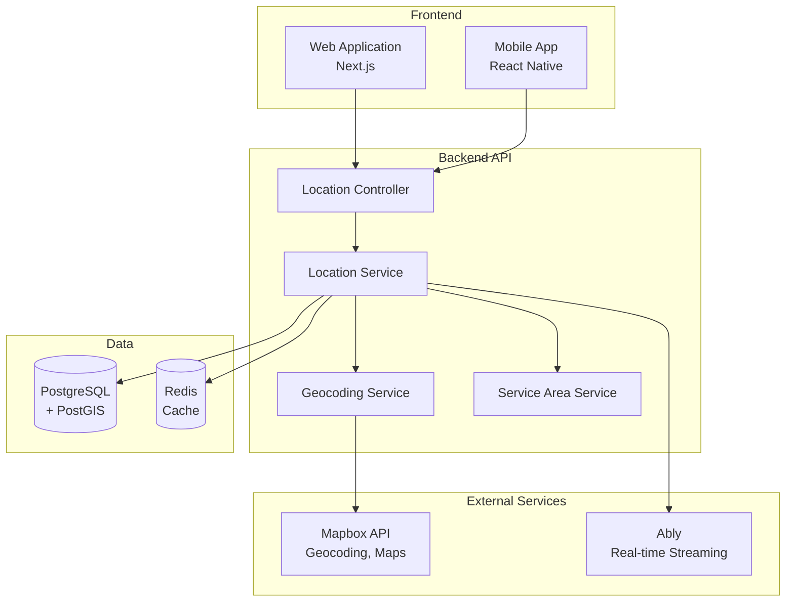

# Location & Mapping API Specification (SDS)

**Document Version**: 1.0
**Created**: 2025-11-10
**Author**: AI:ArtifactCreator
**Decision Reference**: D-6-LocationMappingArchitecture
**Related Specs**: A-1-1 (System Architecture), D-2 (API Design)

---

## 1. Overview

This document specifies the **Location & Mapping API** for the Aegis platform, providing endpoints for geocoding, map interaction, location tracking, and service area validation. These APIs enable the frontend to display interactive maps, convert addresses to coordinates, track guard locations in real-time, and validate service coverage.

### 1.1 Purpose

Provide comprehensive location and mapping capabilities:
- Address geocoding (text → coordinates)
- Reverse geocoding (coordinates → address)
- Map configuration and tile access
- Real-time guard location tracking
- Location history and route visualization
- Service area validation
- Geofencing for job sites

### 1.2 Scope

**In Scope**:
- Geocoding API endpoints (proxy to Mapbox)
- Location update and retrieval endpoints
- Map configuration and token management
- Location history for route visualization
- Service area boundary checking
- Guard location streaming via Ably

**Out of Scope** (Future):
- Turn-by-turn navigation
- Traffic data integration
- Route optimization
- Multi-stop routing
- Custom map styles

---

## 2. Architecture

### 2.1 System Context



### 2.2 Module Structure

```
src/
├── modules/
│   ├── locations/
│   │   ├── locations.module.ts
│   │   ├── locations.controller.ts
│   │   ├── locations.service.ts
│   │   ├── services/
│   │   │   ├── geocoding.service.ts
│   │   │   ├── service-area.service.ts
│   │   │   └── location-stream.service.ts
│   │   ├── dto/
│   │   │   ├── geocode-forward.dto.ts
│   │   │   ├── geocode-reverse.dto.ts
│   │   │   ├── update-location.dto.ts
│   │   │   └── location-history.dto.ts
│   │   ├── entities/
│   │   │   └── location-history.entity.ts
│   │   └── interfaces/
│   │       ├── geocoded-result.interface.ts
│   │       └── map-config.interface.ts
│   └── jobs/
│       └── jobs.module.ts (existing)
```

---

## 3. API Endpoints

### 3.1 Geocoding - Forward (Address → Coordinates)

**Endpoint**: `POST /api/geocoding/forward`

**Purpose**: Convert text address to geographic coordinates for job creation

**Authentication**: Required (JWT)

**Request DTO**:
```typescript
// src/modules/locations/dto/geocode-forward.dto.ts
export class GeocodeForwardDto {
  @IsString()
  @MinLength(3)
  address: string;

  @IsOptional()
  @IsString()
  proximity?: string;  // lat,lon to bias results

  @IsOptional()
  @IsArray()
  @IsString({ each: true })
  types?: string[];  // ['address', 'poi', 'place']

  @IsOptional()
  @IsNumber()
  limit?: number;  // Max results (default: 5)
}
```

**Response**:
```typescript
export interface GeocodedResult {
  type: 'Feature';
  id: string;
  place_name: string;  // "123 Main St, Los Angeles, CA 90001, USA"
  text: string;        // "123 Main St"
  place_type: string[]; // ['address']
  center: [number, number];  // [longitude, latitude]
  geometry: {
    type: 'Point';
    coordinates: [number, number];
  };
  properties: {
    accuracy?: string;
  };
  context: Array<{
    id: string;
    text: string;  // e.g., "Los Angeles" for city
    short_code?: string;  // e.g., "US-CA" for state
  }>;
}

export interface GeocodeForwardResponse {
  type: 'FeatureCollection';
  query: string[];
  features: GeocodedResult[];
  attribution: string;
}
```

**Example Request**:
```json
POST /api/geocoding/forward
{
  "address": "123 Main St, Los Angeles, CA",
  "types": ["address"],
  "limit": 5
}
```

**Example Response**:
```json
{
  "type": "FeatureCollection",
  "query": ["123", "main", "st", "los", "angeles", "ca"],
  "features": [
    {
      "id": "address.123456",
      "type": "Feature",
      "place_type": ["address"],
      "place_name": "123 Main St, Los Angeles, California 90012, United States",
      "text": "Main St",
      "center": [-118.2437, 34.0522],
      "geometry": {
        "type": "Point",
        "coordinates": [-118.2437, 34.0522]
      },
      "properties": {
        "accuracy": "rooftop"
      },
      "context": [
        { "id": "postcode.123", "text": "90012" },
        { "id": "place.456", "text": "Los Angeles" },
        { "id": "region.789", "text": "California", "short_code": "US-CA" }
      ]
    }
  ]
}
```

**Error Responses**:
- `400 Bad Request`: Invalid address format
- `429 Too Many Requests`: Rate limit exceeded (10 req/sec per user)
- `503 Service Unavailable`: Mapbox API unavailable

**Implementation Notes**:
- Cache results in Redis for 24 hours (addresses rarely change)
- Rate limit: 10 requests/second per user
- Proxy to Mapbox Geocoding API
- Log requests for usage tracking (cost monitoring)

---

### 3.2 Geocoding - Reverse (Coordinates → Address)

**Endpoint**: `POST /api/geocoding/reverse`

**Purpose**: Convert coordinates to human-readable address (e.g., map pin location)

**Authentication**: Required (JWT)

**Request DTO**:
```typescript
export class GeocodeReverseDto {
  @IsNumber()
  @Min(-90)
  @Max(90)
  latitude: number;

  @IsNumber()
  @Min(-180)
  @Max(180)
  longitude: number;

  @IsOptional()
  @IsArray()
  @IsString({ each: true })
  types?: string[];  // ['address', 'poi', 'place']

  @IsOptional()
  @IsNumber()
  limit?: number;  // Max results (default: 1)
}
```

**Response**: Same as forward geocoding (`GeocodeForwardResponse`)

**Example Request**:
```json
POST /api/geocoding/reverse
{
  "latitude": 34.0522,
  "longitude": -118.2437,
  "types": ["address"],
  "limit": 1
}
```

**Example Response**:
```json
{
  "type": "FeatureCollection",
  "query": [-118.2437, 34.0522],
  "features": [
    {
      "id": "address.123456",
      "place_name": "123 Main St, Los Angeles, California 90012, United States",
      "center": [-118.2437, 34.0522],
      "geometry": {
        "type": "Point",
        "coordinates": [-118.2437, 34.0522]
      }
    }
  ]
}
```

**Implementation Notes**:
- Cache results in Redis for 24 hours
- Round coordinates to 5 decimal places for cache key (~1 meter precision)
- Rate limit: 10 requests/second per user

---

### 3.3 Map Configuration

**Endpoint**: `GET /api/map/config`

**Purpose**: Provide frontend with map configuration (Mapbox token, style URL)

**Authentication**: Required (JWT)

**Response**:
```typescript
export interface MapConfigResponse {
  provider: 'mapbox';
  accessToken: string;  // Public Mapbox token
  styleUrl: string;     // Mapbox style URL
  defaultCenter: {
    latitude: number;
    longitude: number;
  };
  defaultZoom: number;
  maxBounds?: {  // Optional: restrict map to service area
    southwest: { latitude: number; longitude: number };
    northeast: { latitude: number; longitude: number };
  };
  features: {
    geocoding: boolean;
    routing: boolean;
    realTimeTracking: boolean;
  };
}
```

**Example Response**:
```json
{
  "provider": "mapbox",
  "accessToken": "pk.eyJ1IjoiYWVnaXMtcGxhdGZvcm0iLCJhIjoiY2x2...",
  "styleUrl": "mapbox://styles/mapbox/streets-v12",
  "defaultCenter": {
    "latitude": 34.0522,
    "longitude": -118.2437
  },
  "defaultZoom": 12,
  "maxBounds": {
    "southwest": { "latitude": 33.7, "longitude": -118.7 },
    "northeast": { "latitude": 34.3, "longitude": -117.8 }
  },
  "features": {
    "geocoding": true,
    "routing": false,
    "realTimeTracking": true
  }
}
```

**Implementation Notes**:
- Token is **public** Mapbox token (restricted by URL referrer)
- Cache config in Redis for 1 hour
- Token rotation handled via environment variable update
- Different tokens for development/staging/production

---

### 3.4 Update Guard Location

**Endpoint**: `POST /api/jobs/:jobId/location`

**Purpose**: Guard updates their current location during active job

**Authentication**: Required (JWT, Guard role)

**Authorization**: Guard must be assigned to the job

**Request DTO**:
```typescript
export class UpdateLocationDto {
  @IsNumber()
  @Min(-90)
  @Max(90)
  latitude: number;

  @IsNumber()
  @Min(-180)
  @Max(180)
  longitude: number;

  @IsNumber()
  @Min(0)
  @Max(1000)
  accuracy: number;  // Meters

  @IsOptional()
  @IsNumber()
  altitude?: number;  // Meters above sea level

  @IsOptional()
  @IsNumber()
  speed?: number;  // Meters per second

  @IsOptional()
  @IsNumber()
  heading?: number;  // Degrees (0-360)

  @IsDate()
  @Type(() => Date)
  timestamp: Date;
}
```

**Response**:
```typescript
export interface LocationUpdateResponse {
  success: boolean;
  locationId: string;
  receivedAt: Date;
  broadcastedToCustomer: boolean;
}
```

**Example Request**:
```json
POST /api/jobs/550e8400-e29b-41d4-a716-446655440000/location
{
  "latitude": 34.0522,
  "longitude": -118.2437,
  "accuracy": 15,
  "speed": 1.5,
  "heading": 270,
  "timestamp": "2025-11-10T10:30:00Z"
}
```

**Example Response**:
```json
{
  "success": true,
  "locationId": "loc_abc123",
  "receivedAt": "2025-11-10T10:30:01Z",
  "broadcastedToCustomer": true
}
```

**Business Logic**:
1. Validate job is in `in_progress` status
2. Validate guard is assigned to job
3. Validate accuracy < 100 meters (reject poor readings)
4. Store in `location_history` table
5. Update job's `tracking_points` JSONB (last 50 points)
6. Broadcast to Ably channel `jobs:{jobId}:location`
7. Check geofence (if guard entered/exited job site)

**Rate Limiting**:
- Max 4 updates per minute per job (15-second intervals)
- Burst allowance: 10 updates in 1 minute

**Offline Handling** (See Q-10, Q-11):
- Mobile app batches location updates when offline
- Backend accepts array of location updates (batch endpoint)
- Timestamps must be sequential and within last 24 hours

---

### 3.5 Get Current Guard Location

**Endpoint**: `GET /api/jobs/:jobId/location`

**Purpose**: Customer views guard's current location during active job

**Authentication**: Required (JWT)

**Authorization**:
- Customer must be the job creator
- OR Guard assigned to job
- OR Admin role

**Response**:
```typescript
export interface CurrentLocationResponse {
  guardId: string;
  location: {
    latitude: number;
    longitude: number;
    accuracy: number;
    heading?: number;
    speed?: number;
  };
  timestamp: Date;
  status: 'active' | 'stale' | 'offline';
  lastSeenAt: Date;
}
```

**Example Response**:
```json
{
  "guardId": "guard_123",
  "location": {
    "latitude": 34.0522,
    "longitude": -118.2437,
    "accuracy": 15,
    "heading": 270,
    "speed": 1.5
  },
  "timestamp": "2025-11-10T10:30:00Z",
  "status": "active",
  "lastSeenAt": "2025-11-10T10:30:01Z"
}
```

**Status Definitions**:
- `active`: Last update within 60 seconds
- `stale`: Last update 60-300 seconds ago
- `offline`: Last update > 300 seconds ago

**Caching**:
- Cache in Redis for 10 seconds
- Invalidate on new location update

---

### 3.6 Get Location History (Route)

**Endpoint**: `GET /api/jobs/:jobId/location/history`

**Purpose**: Retrieve guard's route history for visualization

**Authentication**: Required (JWT)

**Authorization**: Same as current location endpoint

**Query Parameters**:
```typescript
export class LocationHistoryQueryDto {
  @IsOptional()
  @IsDate()
  @Type(() => Date)
  since?: Date;  // Start time (default: job start time)

  @IsOptional()
  @IsDate()
  @Type(() => Date)
  until?: Date;  // End time (default: now)

  @IsOptional()
  @IsInt()
  @Min(1)
  @Max(1000)
  limit?: number;  // Max points (default: 200)

  @IsOptional()
  @IsBoolean()
  simplified?: boolean;  // Apply Douglas-Peucker simplification
}
```

**Response**:
```typescript
export interface LocationHistoryResponse {
  jobId: string;
  guardId: string;
  startTime: Date;
  endTime: Date;
  totalPoints: number;
  totalDistance: number;  // Meters
  route: {
    type: 'LineString';
    coordinates: Array<[number, number, Date]>;  // [lon, lat, timestamp]
  };
  points: Array<{
    latitude: number;
    longitude: number;
    accuracy: number;
    timestamp: Date;
    speed?: number;
    heading?: number;
  }>;
}
```

**Example Response**:
```json
{
  "jobId": "550e8400-e29b-41d4-a716-446655440000",
  "guardId": "guard_123",
  "startTime": "2025-11-10T10:00:00Z",
  "endTime": "2025-11-10T14:00:00Z",
  "totalPoints": 120,
  "totalDistance": 2500,
  "route": {
    "type": "LineString",
    "coordinates": [
      [-118.2437, 34.0522, "2025-11-10T10:00:00Z"],
      [-118.2438, 34.0523, "2025-11-10T10:00:30Z"]
    ]
  },
  "points": [
    {
      "latitude": 34.0522,
      "longitude": -118.2437,
      "accuracy": 15,
      "timestamp": "2025-11-10T10:00:00Z",
      "speed": 0,
      "heading": 0
    }
  ]
}
```

**Implementation Notes**:
- Query PostGIS `location_history` table with spatial index
- Use ST_MakeLine() to create route geometry
- Apply Douglas-Peucker simplification for large datasets
- Calculate total distance using ST_Length()
- Cache results for 5 minutes

---

### 3.7 Validate Service Area

**Endpoint**: `POST /api/locations/validate-service-area`

**Purpose**: Check if a location is within Aegis service coverage

**Authentication**: Optional (public endpoint for initial checks)

**Request DTO**:
```typescript
export class ValidateServiceAreaDto {
  @IsNumber()
  latitude: number;

  @IsNumber()
  longitude: number;
}
```

**Response**:
```typescript
export interface ServiceAreaValidationResponse {
  inServiceArea: boolean;
  city?: string;
  state?: string;
  availableGuards?: number;  // If in service area
  estimatedWaitTime?: number;  // Minutes
  message?: string;  // If not in service area
  nearestServicedCity?: {
    name: string;
    distance: number;  // Kilometers
  };
}
```

**Example Response (In Service Area)**:
```json
{
  "inServiceArea": true,
  "city": "Los Angeles",
  "state": "CA",
  "availableGuards": 15,
  "estimatedWaitTime": 12
}
```

**Example Response (Out of Service Area)**:
```json
{
  "inServiceArea": false,
  "message": "We're not yet available in your area.",
  "nearestServicedCity": {
    "name": "Los Angeles",
    "distance": 45.3
  }
}
```

**Implementation**:
- Query PostGIS with predefined service area polygons
- Use ST_Contains() or ST_Within() for spatial check
- Count available guards in radius (10 miles) if in service area
- Cache result for 1 hour per lat/lon (rounded to 2 decimals)

---

### 3.8 Batch Location Update (Offline Sync)

**Endpoint**: `POST /api/jobs/:jobId/location/batch`

**Purpose**: Upload multiple location updates after reconnection (offline sync)

**Authentication**: Required (JWT, Guard role)

**Request DTO**:
```typescript
export class BatchLocationUpdateDto {
  @IsArray()
  @ValidateNested({ each: true })
  @Type(() => UpdateLocationDto)
  @ArrayMaxSize(100)  // Max 100 points per batch
  locations: UpdateLocationDto[];
}
```

**Response**:
```typescript
export interface BatchLocationResponse {
  success: boolean;
  accepted: number;
  rejected: number;
  errors?: Array<{
    index: number;
    reason: string;
  }>;
}
```

**Example Request**:
```json
POST /api/jobs/550e8400-e29b-41d4-a716-446655440000/location/batch
{
  "locations": [
    {
      "latitude": 34.0522,
      "longitude": -118.2437,
      "accuracy": 15,
      "timestamp": "2025-11-10T10:00:00Z"
    },
    {
      "latitude": 34.0523,
      "longitude": -118.2438,
      "accuracy": 12,
      "timestamp": "2025-11-10T10:00:30Z"
    }
  ]
}
```

**Business Logic**:
- Validate timestamps are sequential
- Reject points with accuracy > 100 meters
- Reject duplicate timestamps
- Insert all valid points in single transaction
- Broadcast only the latest location to Ably

---

## 4. Real-Time Location Streaming (Ably)

### 4.1 Channel Structure

**Customer subscribes to guard location updates**:
```typescript
// Channel name
const channel = ably.channels.get(`jobs:${jobId}:location`);

// Subscribe to location updates
channel.subscribe('location-update', (message) => {
  const location = message.data;
  updateMapMarker(location);
});
```

**Message Format**:
```typescript
interface LocationUpdateMessage {
  guardId: string;
  latitude: number;
  longitude: number;
  accuracy: number;
  heading?: number;
  speed?: number;
  timestamp: string;  // ISO 8601
}
```

### 4.2 Connection States

**Frontend handles connection states**:
- `connected`: Real-time updates active
- `suspended`: Temporary connection loss, buffering
- `failed`: Fall back to polling API every 30 seconds

---

## 5. Data Models

### 5.1 LocationHistory Entity

```typescript
// src/modules/locations/entities/location-history.entity.ts
@Entity('location_history')
@Index(['jobId', 'recordedAt'])
@Index(['guardId', 'recordedAt'])
export class LocationHistory {
  @PrimaryGeneratedColumn('uuid')
  id: string;

  @Column('uuid', { name: 'guard_id' })
  @Index()
  guardId: string;

  @Column('uuid', { name: 'job_id' })
  @Index()
  jobId: string;

  @Column({
    type: 'geography',
    spatialFeatureType: 'Point',
    srid: 4326
  })
  @Index({ spatial: true })
  location: string;  // PostGIS geography

  @Column('float', { name: 'accuracy_meters' })
  accuracyMeters: number;

  @Column('float', { nullable: true })
  altitude?: number;

  @Column('float', { nullable: true })
  speed?: number;

  @Column('float', { nullable: true })
  heading?: number;

  @Column('timestamp', { name: 'recorded_at' })
  @Index()
  recordedAt: Date;

  @CreateDateColumn({ name: 'created_at' })
  createdAt: Date;
}
```

### 5.2 Service Area Polygons

```sql
-- Service area definition table
CREATE TABLE service_areas (
  id UUID PRIMARY KEY DEFAULT uuid_generate_v4(),
  city VARCHAR(100) NOT NULL,
  state VARCHAR(2) NOT NULL,
  boundary GEOGRAPHY(POLYGON, 4326) NOT NULL,
  is_active BOOLEAN DEFAULT true,
  created_at TIMESTAMP DEFAULT NOW(),
  updated_at TIMESTAMP DEFAULT NOW()
);

-- Spatial index for fast containment queries
CREATE INDEX idx_service_areas_boundary ON service_areas USING GIST (boundary);

-- Example: Los Angeles service area (simplified)
INSERT INTO service_areas (city, state, boundary) VALUES (
  'Los Angeles',
  'CA',
  ST_GeogFromText('POLYGON((-118.7 33.7, -117.8 33.7, -117.8 34.3, -118.7 34.3, -118.7 33.7))')
);
```

---

## 6. Integration with Mapbox

### 6.1 Mapbox Geocoding API

**Forward Geocoding**:
```
GET https://api.mapbox.com/geocoding/v5/mapbox.places/{address}.json
  ?access_token={token}
  &proximity={lon},{lat}
  &types=address,poi
  &limit=5
```

**Reverse Geocoding**:
```
GET https://api.mapbox.com/geocoding/v5/mapbox.places/{lon},{lat}.json
  ?access_token={token}
  &types=address
  &limit=1
```

### 6.2 Map Rendering (Frontend)

**Web (Mapbox GL JS)**:
```javascript
import mapboxgl from 'mapbox-gl';

mapboxgl.accessToken = config.accessToken;
const map = new mapboxgl.Map({
  container: 'map',
  style: config.styleUrl,
  center: [config.defaultCenter.longitude, config.defaultCenter.latitude],
  zoom: config.defaultZoom
});

// Add guard marker
const marker = new mapboxgl.Marker({ color: '#4F46E5' })
  .setLngLat([location.longitude, location.latitude])
  .addTo(map);
```

**Mobile (React Native Mapbox)**:
```jsx
import Mapbox from '@rnmapbox/maps';

Mapbox.setAccessToken(config.accessToken);

<Mapbox.MapView style={styles.map}>
  <Mapbox.Camera
    centerCoordinate={[location.longitude, location.latitude]}
    zoomLevel={14}
  />
  <Mapbox.PointAnnotation
    id="guard-marker"
    coordinate={[location.longitude, location.latitude]}
  />
</Mapbox.MapView>
```

---

## 7. Performance & Optimization

### 7.1 Caching Strategy

| Endpoint | Cache Duration | Invalidation |
|----------|---------------|--------------|
| Forward geocoding | 24 hours | N/A (addresses rarely change) |
| Reverse geocoding | 24 hours | N/A |
| Map config | 1 hour | On token rotation |
| Current location | 10 seconds | On new location update |
| Location history | 5 minutes | On job completion |
| Service area validation | 1 hour | On service area changes |

### 7.2 Rate Limiting

| Endpoint | Limit | Window |
|----------|-------|--------|
| Geocoding (forward/reverse) | 10 req/sec | Per user |
| Location updates | 4 req/min | Per job |
| Batch location updates | 10 req/min | Per job |
| Location history | 20 req/min | Per user |

### 7.3 Database Optimization

**Indexes**:
- Spatial indexes (GIST) on all geography columns
- Composite index on `(job_id, recorded_at)` for history queries
- Partial index on active jobs for current location lookups

**Data Retention**:
- Location history retained for 30 days
- Automated daily cron job deletes old records
- Archived to S3 for compliance (7 years)

---

## 8. Security Considerations

### 8.1 Location Privacy

- Location updates only during active jobs
- Customers can only view guards assigned to their jobs
- Guards can only update locations for their assigned jobs
- Location history deleted 30 days after job completion

### 8.2 Mapbox Token Security

**Public Token** (Frontend):
- URL referrer restrictions (only aegis.com domains)
- Rate limiting via Mapbox dashboard
- No secret scopes (tiles, geocoding only)

**Secret Token** (Backend):
- Environment variable only
- Used for geocoding API proxying
- Never exposed to frontend

### 8.3 Geofencing Alerts

- Alert if guard leaves job site radius (configurable, default: 100 meters)
- Alert if guard hasn't moved in > 30 minutes (potential issue)
- Alert if location accuracy consistently poor (GPS issues)

---

## 9. Testing Requirements

### 9.1 Unit Tests

```typescript
describe('GeocodingService', () => {
  it('should geocode valid address', async () => {
    const result = await geocodingService.forwardGeocode('123 Main St, LA');
    expect(result.features).toHaveLength(greaterThan(0));
    expect(result.features[0].center).toEqual([-118.2437, 34.0522]);
  });

  it('should handle invalid addresses gracefully', async () => {
    const result = await geocodingService.forwardGeocode('invalid!!!');
    expect(result.features).toHaveLength(0);
  });
});

describe('ServiceAreaService', () => {
  it('should validate location within service area', async () => {
    const result = await serviceAreaService.validate(34.0522, -118.2437);
    expect(result.inServiceArea).toBe(true);
  });

  it('should return nearest city for out-of-area location', async () => {
    const result = await serviceAreaService.validate(40.7128, -74.0060); // NYC
    expect(result.inServiceArea).toBe(false);
    expect(result.nearestServicedCity).toBeDefined();
  });
});
```

### 9.2 Integration Tests

- Test with real Mapbox sandbox API
- Test PostGIS spatial queries with test database
- Test Ably broadcasting with test channels

### 9.3 E2E Tests

- Customer creates job with map pin location
- Guard accepts job and starts location tracking
- Customer views guard location on map in real-time
- Location history displays complete route after job completion

---

## 10. Monitoring & Alerts

### 10.1 Key Metrics

- Geocoding API response time (p95 < 100ms)
- Location update latency (mobile → customer < 2 seconds)
- Mapbox API error rate (< 0.1%)
- Cache hit rate (> 80% for geocoding)
- Location accuracy distribution (median < 20 meters)

### 10.2 Alerts

- Mapbox API down (fallback to cached geocoding)
- Location update delays > 5 seconds
- Excessive poor accuracy readings (> 100 meters)
- Service area validation failures

---

## 11. Future Enhancements

**Short-term (Post-MVP)**:
1. Turn-by-turn navigation for guards
2. ETA calculation and updates
3. Traffic-aware routing

**Medium-term**:
4. Custom map styles (branding)
5. Heatmap of guard availability by area
6. Route optimization for multi-stop jobs

**Long-term**:
7. Offline map tiles for mobile
8. 3D building visualization
9. Indoor positioning (via WiFi/BLE beacons)

---

## 12. Cost Estimation

### 12.1 Mapbox Costs

**Free Tier**:
- 50,000 map loads/month
- 100,000 geocoding requests/month

**Projected MVP Usage** (100 active guards, 50 jobs/day):
- Map loads: ~5,000/month (well within free tier)
- Geocoding: ~1,500/month (well within free tier)

**Production Costs** (1,000 guards, 500 jobs/day):
- Map loads: ~50,000/month = **$0** (free tier)
- Geocoding: ~15,000/month = **$0** (free tier)
- Location tracking: Via Ably (separate cost)

---

## 13. References

- **D-2**: MVP API Design & Integration Strategy
- **D-6**: Location & Mapping Architecture (Decision)
- **Q-11**: GPS Tracking Implementation Research
- **A-1-1**: System Architecture Document
- **Mapbox Geocoding API**: https://docs.mapbox.com/api/search/geocoding/
- **PostGIS Documentation**: https://postgis.net/docs/reference.html

---

**Document Status**: ✅ Complete
**Last Updated**: 2025-11-10
**Implementation Target**: Week 7-8 (Phase 5: API Layer)
